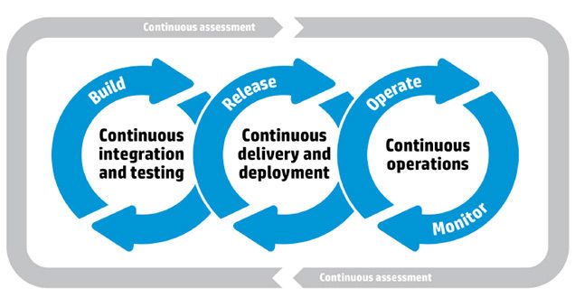

# CI/CD Basic concepts

### Continuous integration

Developers practicing continuous integration merge their changes back to the main branch as often as possible. The developer's changes are validated by creating a build and running automated tests against the build. By doing so, you avoid the integration hell that usually happens when people wait for release day to merge their changes into the release branch.

Continuous integration puts a great emphasis on testing automation to check that the application is not broken whenever new commits are integrated into the main branch.

#### **What you need \(cost\)**

* Your team will need to write automated tests for each new feature, improvement or bug fix. 
* You need a continuous integration server that can monitor the main repository and run the tests automatically for every new commits pushed. 
* Developers need to merge their changes as often as possible, at least once a day.

#### What you gain

* Less bugs get shipped to production as regressions are captured early by the automated tests.
* Building the release is easy as all integration issues have been solved early. 
* Less context switching as developers are alerted as soon as they break the build and can work on fixing it before they move to another task. 
* Testing costs are reduced drastically – your CI server can run hundreds of tests in the matter of seconds. 
* Your QA team spend less time testing and can focus on significant improvements to the quality culture.

### Continuous delivery

Continuous delivery is an extension of continuous integration to make sure that you can release new changes to your customers quickly in a sustainable way. This means that on top of having automated your testing, you also have automated your release process and you can deploy your application at any point of time by clicking on a button.

In theory, with continuous delivery, you can decide to release daily, weekly, fortnightly, or whatever suits your business requirements. However, if you truly want to get the benefits of continuous delivery, you should deploy to production as early as possible to make sure that you release small batches that are easy to troubleshoot in case of a problem.

#### What you need \(cost\)

* You need a strong foundation in continuous integration and your test suite needs to cover enough of your codebase. 
* Deployments need to be automated. 
* The trigger is still manual but once a deployment is started there shouldn't be a need for human intervention. 
* Your team will most likely need to embrace feature flags so that incomplete features do not affect customers in production.

#### What you gain

* The complexity of deploying software has been taken away. 
* Your team doesn't have to spend days preparing for a release anymore. 
* You can release more often, thus accelerating the feedback loop with your customers. 
* There is much less pressure on decisions for small changes, hence encouraging iterating faster.

### Continuous deployment

Continuous deployment goes one step further than continuous delivery. With this practice, every change that passes all stages of your production pipeline is released to your customers. There's no human intervention, and only a failed test will prevent a new change to be deployed to production.

Continuous deployment is an excellent way to accelerate the feedback loop with your customers and take pressure off the team as there isn't a Release Day anymore. Developers can focus on building software, and they see their work go live minutes after they've finished working on it.

#### What you need \(cost\)

* Your testing culture needs to be at its best. 
* The quality of your test suite will determine the quality of your releases.
* Your documentation process will need to keep up with the pace of deployments. 
* Feature flags become an inherent part of the process of releasing significant changes to make sure you can coordinate with other departments \(Support, Marketing, PR...\).

#### What you gain

* You can develop faster as there's no need to pause development for releases. 
* Deployments pipelines are triggered automatically for every change. 
* Releases are less risky and easier to fix in case of problem as you deploy small batches of changes.
* Customers see a continuous stream of improvements, and quality increases every day, instead of every month, quarter or year.

