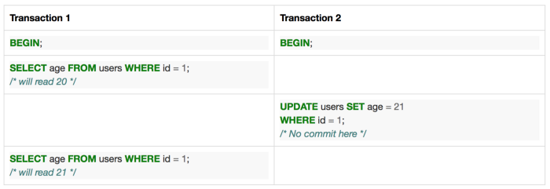
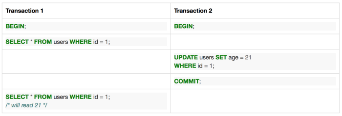
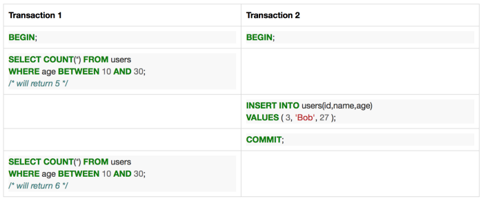

# Isolation levels understanding

### Side effects

#### Dirty Reads

A _dirty read_ is when the current transaction reads a row written by another uncommitted transaction that’s currently in-flight.

#### **Non-repeatable Reads**

A _non-repeatable read_ occurs when the current transaction reads the same data but this time it is different.

It is different from "dirty reads" because another transaction has been committed during the life of the current transaction**.**

#### **Phantom Reads**

A _phantom read_ happens when the current transaction re-executes a query returning a set of rows that satisfy a search condition and finds that the set of rows satisfying the condition has changed due to another recently-committed transaction.

This can be thought of as a special type of non-repeatable read**.**

The distinction is that that the original rows are re-read correctly \(even if they had been changed\) but a new row \(or rows\) have been inserted into the range it previously selected. So it hasn’t broken the re-read rule, but the data returned is still different.

### **Transaction types**

The SQL Standard defines four isolation levels which are described by what type of errors they are allowed to permit**:**

* **Read uncommitted** permits dirty reads, non repeatable reads and phantom reads.
* **Read committed** permits non repeatable reads and phantom reads.
* **Repeatable read** permits only phantom reads.
* **Serializable** does not permit any read errors.

Microsoft SQL Server supports all four transaction isolation levels with the default being read committed. SQL Server also has a fifth option called “snapshot” which allows transactions to see a consistent read state.

#### **Read Uncommitted**

“Read uncommitted” is the most loose transaction isolation and is in fact not even implemented in some databases because it is too loose to be useful. A transaction in this mode is susceptible to all types of read errors mentioned above since it is not required to even check if a row is committed or not.

#### **Read Committed**

“Read committed” is the most common transaction isolation and usually is the default as it has the best balance between locking and performance. It will never read versions of rows that are currently uncommitted, however it is still susceptible to other transactions changing data between statements.

#### **Repeatable Read**

“Repeatable read” ensures rows that have been read \(rather than modified\) will still be read, even if they are changed by other transactions. This provides an almost true snapshot of the data however it does incur overhead with locking and/or causing other transactions to be rolled back more commonly.

#### **Serializable**

In a perfect world \(at least for a database\) we would like only one client to be connected to the database at a any given time. This would guarantee there are no side effects between concurrent clients, since there are none.

This is “Serializable”, the most strict mode and works exactly like this — client perform transactions in serial.

**Snapshot**

Once snapshot isolation is enabled, updated row versions for each transaction are maintained in **tempdb**. A unique transaction sequence number identifies each transaction, and these unique numbers are recorded for each row version. The transaction works with the most recent row versions having a sequence number before the sequence number of the transaction. Newer row versions created after the transaction has begun are ignored by the transaction.

