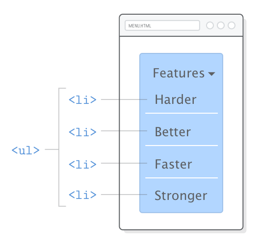

# CSS: Simple Style rules


CSS provides the vocabulary to tell a web browser things like, “I want my headings to be really big and my sidebar to appear on the left of the main article.” HTML doesn’t have the terminology to make those kinds of layout decisions—all it can say is, “that’s a heading and that’s a sidebar.”

### css stylesheets

 CSS stylesheets reside in plaintext files with a `.css` extension. Create a new file called `styles.css` in our `hello-css` folder. This will house all our example snippets for this chapter.

```css
body {
  color: #FF0000;
}
```

A CSS “rule” always start with a “selector” that defines which HTML elements it applies to. In this case, we’re trying to style the `<body>` element. After the selector, we have the “declarations block” inside of some curly braces. Any “properties” we set in here will affect the `<body>` element.


 `color` is a built-in property defined by the CSS specification that determines the text color of whatever HTML elements have been selected. It accepts a hexadecimal value representing a color. `#FF0000` means bright red.

### linking a css stylesheet

If you try loading either of the HTML pages in a browser, you won’t see our stylesheet in action. That’s because we didn’t link them together yet. This is what the HTML `<link/>` element is for. In `hello-css.html`, change `<head>`to the following:

```markup
<head>
  <meta charset='UTF-8'/>
  <title>Hello, CSS</title>
  <link rel='stylesheet' href='styles.css'/>
</head>
```

This `<link/>` element is how browsers know they need to load `styles.css`when they try to render our `hello-css.html` page. We should now see blindingly red text everywhere:


Note that there’s no _direct_ connection between the browser and our stylesheet. It’s only through the HTML markup that the browser can find it. CSS, images, and even JavaScript all rely on an HTML page to glue everything together, making HTML the heart of most websites.

### css comments

 Notice that comments in CSS are a little different than their HTML counterparts. Instead of the `<!-- -->` syntax, CSS ignores everything between `/*` and `*/` characters.

### setting multiple properties

You can stick as many properties as you want in the declarations block of a CSS rule.

```css
body {
  color: #414141;               /* Dark gray */
  background-color: #EEEEEE;    /* Light gray */
}
```

### selecting different elements

Of course, you’ll want to apply styles to elements other than `<body>`. For that, simply add more CSS rules with different selectors. We can change the font size of our `<h1>` headings like so:

```css
body {
  color: #414141;               /* Dark gray */
  background-color: #EEEEEE;    /* Light gray */
}

h1 {
  font-size: 36px;
}
```

And, if you want to alter `h2` headings, add another rule:

```css
h2 {
  font-size: 28px;
}
```

### units of measurement

 Many CSS properties require a unit of measurement. There’s [a lot of units](https://developer.mozilla.org/en-US/docs/Web/CSS/length)available, but the most common ones you’ll encounter are `px` \(pixel\) and `em`\(pronounced like the letter _m_\). 


The `em` unit is very useful for defining sizes relative to some base font. In the above diagram, you can see `em` units scaling to match a base font size of `12px`, `16px`, and `20px`. For a concrete example, consider the following alternative to the previous code snippet:

```css
body {
  color: #414141;               /* Dark gray */
  background-color: #EEEEEE;    /* Light gray */
  font-size: 18px;
}

h1 {
  font-size: 2em;
}

h2 {
  font-size: 1.6em;
}
```

 This sets our base font size for the document to `18px`, then says that our `<h1>` elements should be twice that size and our `<h2>`’s should be 1.6 times bigger. If we \(or the user\) ever wanted to make the base font bigger or smaller, `em` units would allow our entire page to scale accordingly.

### selecting multiple elements

```text
h1, h2, h3, h4, h5, h6 {
  font-family: "Helvetica", "Arial", sans-serif;
}
```

This defines the font to use for all of our headings with a single rule. That’s great, ’cause if we ever want to change it, we only have to do so in one place. Copying and pasting code is usually a bad idea for web developers, and multiple selectors can help reduce that kind of behavior quite a bit.


### defining fonts

`font-family` is another built-in CSS property that defines the typeface for whatever element you selected. It accepts multiple values because not all users will have the same fonts installed. With the above snippet, the browser tries to load the left-most one first \(`Helvetica`\), falls back to `Arial`if the user doesn’t have it, and finally chooses the system’s default sans serif font.


### list styles

The `list-style-type` property lets you alter the bullet icon used for `<li>`elements. You’ll typically want to define it on the parent `<ul>` or `<ol>`element:

```css
ul {
  list-style-type: circle;
}

ol {
  list-style-type: lower-roman;
}
```



### reusable stylesheets

 Whenever we change a style in `styles.css`, those changes will automatically be reflected in both of our web pages. This is how you get a consistent look and feel across an entire website.


### the cascade


The CSS hierarchy for every web page looks like this:

* The browser’s default stylesheet
* User-defined stylesheets
* External stylesheets \(that’s us\)
* Page-specific styles \(that’s also us\)
* Inline styles \(that could be us, but it never should be\)

This is ordered from least to most precedence, which means styles defined in each subsequent step _override_ previous ones. For example, inline styles will always make the browser ignore its default styles. The next few sections focus on the last two options because that’s what we have control over as web developers \(in addition to the external styles we’ve already been working with\).


We made an effort to get you started down the right path with external stylesheets. It’s important to understand page-specific and inline styles because you’ll most definitely encounter them in the wild, but external stylesheets are by far the best place to define the appearance of your website.

#### page-specific styles <a id="page-specific-styles"></a>

s an example, let’s apply some styles to our `dummy.html` page by updating its `<head>` element to this:

```text
<head>
  <meta charset='UTF-8'/>
  <title>Dummy</title>
  <link rel='stylesheet' href='styles.css'/>
  <style>
    body {
      color: #0000FF;    /* Blue */
    }
  </style>
</head>
```

These apply _only_ to `dummy.html`. Our `hello-css.html` page won’t be affected. If you did it right, you should see bright blue text when you load `dummy.html` in a browser.


Anything you would put in our `styles.css` file can live in this `<style>`element. It uses the exact same CSS syntax as an external stylesheet, but everything here will override rules in our `styles.css` file. In this case, we’re telling the browser to ignore the `color` property we defined for `<body>` in our external stylesheet and use `#0000FF` instead.


The problem with page-specific styles is that they’re incredibly difficult to maintain. As shown in the above diagram, when you want to apply these styles to another page, you have to copy-and-paste them into _that_document’s `<head>`. 

#### inline styles <a id="inline-styles"></a>

```css
<p>Want to try crossing out an <a href='nowhere.html'
   style='color: #990000; text-decoration: line-through;'>obsolete link</a>?
   This is your chance!</p>
```

Like page-specific styles, this is the same CSS syntax we’ve been working with. However, since it’s in an attribute, it needs to be condensed to a single line. Inline styles are the most specific way to define CSS. The `color`and `text-decoration` properties we defined here trump _everything_. Even if we went back and added a `text-decoration: none` to our `<style>`element, it wouldn’t have any effect.


Inline styles should be avoided at all costs because they make it impossible to alter styles from an external stylesheet. If you ever wanted to re-style your website down the road, you can’t just change a few rules in your global `styles.css` file—you’d have to go through every single page and update every single HTML element that has a `style` attribute. It’s horrifying.

#### multiple stylesheets <a id="multiple-stylesheets"></a>

 CSS rules can be spread across several external stylesheets by adding multiple `<link/>` elements to the same page. A common use case is to separate out styles for different sections of your site. This lets you selectively apply consistent styles to distinct categories of web pages.

```markup
<!-- All product pages have this -->
<head>
  <link rel='stylesheet' href='styles.css'/>
  <link rel='stylesheet' href='product.css'/>
</head>
```

```markup
<!-- While all blog posts have this -->
<head>
  <link rel='stylesheet' href='styles.css'/>
  <link rel='stylesheet' href='blog.css'/>
</head>
```

 The order of the `<link/>` elements matters. Stylesheets that come later will override styles in earlier ones. Typically, you’ll put your “base” or “default” styles in a global stylesheet \(`styles.css`\) and supplement them with section-specific stylesheets \(`product.css` and `blog.css`\). This allows you to organize CSS rules into manageable files while avoiding the perils of page-specific and inline styles.


