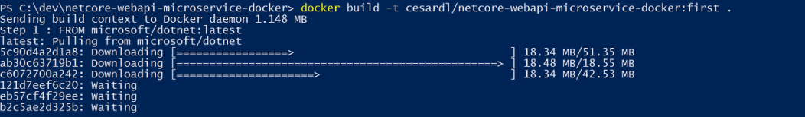
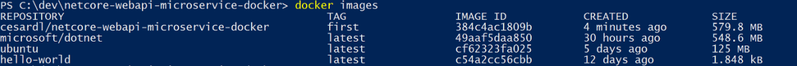
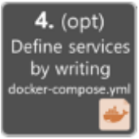
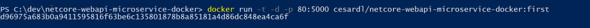

# Development workflow for Docker apps

**Dockerfile**

**Run in a Linux container**

* In the Docker client, switch to Linux containers. 
* Navigate to the Dockerfile folder at dotnet-docker/samples/aspnetapp. 
* Run the following commands to build and run the sample in Docker:

```text
docker build -t aspnetapp .
docker run -it --rm -p 5000:80 --name aspnetcore_sample aspnetapp
```

The build command arguments:

* Name the image aspnetapp. 
* Look for the Dockerfile in the current folder \(the period at the end\).

The run command arguments:

* Allocate a pseudo-TTY and keep it open even if not attached. \(Same effect as --interactive --tty.\)
* Automatically remove the container when it exits.
* Map port 5000 on the local machine to port 80 in the container. 
* Name the container aspnetcore\_sample. 
* Specify the aspnetapp image.
* Go to [http://localhost:5000](http://localhost:5000) in a browser to test the app.

**Run in a Windows container**

* In the Docker client, switch to Windows containers.

Navigate to the docker file folder at `dotnet-docker/samples/aspnetapp.`

Run the following commands to build and run the sample in Docker:

```text
consoleCopy
docker build -t aspnetapp .
docker run -it --rm --name aspnetcore_sample aspnetapp
```

* For Windows containers, you need the IP address of the container \(browsing to [http://localhost:5000won't](http://localhost:5000won't) work\): 
  * Open up another command prompt. 
  * Run docker ps to see the running containers. Verify that the "aspnetcore\_sample" container is there. 
  * Run docker exec aspnetcore\_sample ipconfig to display the IP address of the container. The output from the command looks like this example:

```text
Ethernet adapter Ethernet:

   Connection-specific DNS Suffix  . : contoso.com
   Link-local IPv6 Address . . . . . : fe80::1967:6598:124:cfa3%4
   IPv4 Address. . . . . . . . . . . : 172.29.245.43
   Subnet Mask . . . . . . . . . . . : 255.255.240.0
   Default Gateway . . . . . . . . . : 172.29.240.1
```

* Copy the container IPv4 address \(for example, 172.29.245.43\) and paste into the browser address bar to test the app.

**Build and deploy manually**

In some scenarios, you might want to deploy an app to a container by copying to it the application files that are needed at run time. This section shows how to deploy manually.

* Navigate to the project folder at dotnet-docker/samples/aspnetapp/aspnetapp. 
* Run the dotnet publish command:

```text
dotnet publish -c Release -o published
```

The command arguments:

* Build the application in release mode \(the default is debug mode\). 
* Create the files in the published folder.

Run the application

* Windows

```text
dotnet published\aspnetapp.dll
```

* Linux

```text
dotnet published/aspnetapp.dll
```

Browse to [http://localhost:5000](http://localhost:5000) to see the home page.

**The dockerfile**

Here's the Dockerfile used by the docker build command you ran earlier. It uses dotnet publish the same way you did in this section to build and deploy.

```text
FROM mcr.microsoft.com/dotnet/core/sdk:2.2 AS build
WORKDIR /app

# copy csproj and restore as distinct layers
COPY *.sln .
COPY aspnetapp/*.csproj ./aspnetapp/
RUN dotnet restore

# copy everything else and build app
COPY aspnetapp/. ./aspnetapp/
WORKDIR /app/aspnetapp
RUN dotnet publish -c Release -o out


FROM mcr.microsoft.com/dotnet/core/aspnet:2.2 AS runtime
WORKDIR /app
COPY --from=build /app/aspnetapp/out ./
ENTRYPOINT ["dotnet", "aspnetapp.dll"]
```

## Multi-stage builds in Dockerfile

**Before multi-stage builds**

One of the most challenging things about building images is keeping the image size down. Each instruction in the Dockerfile adds a layer to the image, and you need to remember to clean up any artifacts you don’t need before moving on to the next layer. To write a really efficient Dockerfile, you have traditionally needed to employ shell tricks and other logic to keep the layers as small as possible and to ensure that each layer has the artifacts it needs from the previous layer and nothing else.

It was actually very common to have one Dockerfile to use for development \(which contained everything needed to build your application\), and a slimmed-down one to use for production, which only contained your application and exactly what was needed to run it. This has been referred to as the “builder pattern”. Maintaining two Dockerfiles is not ideal.

Here’s an example of a Dockerfile.build and Dockerfile which adhere to the builder pattern above:

```text
FROM golang:1.7.3
WORKDIR /go/src/github.com/alexellis/href-counter/
COPY app.go .
RUN go get -d -v golang.org/x/net/html \
  && CGO_ENABLED=0 GOOS=linux go build -a -installsuffix cgo -o app .
```


Notice that this example also artificially compresses two RUN commands together using the Bash &&operator, to avoid creating an additional layer in the image. This is failure-prone and hard to maintain. It’s easy to insert another command and forget to continue the line using the  character, for example.


```text
Dockerfile:
FROM alpine:latest  
RUN apk --no-cache add ca-certificates
WORKDIR /root/
COPY app .
CMD ["./app"]  
```

```text
build.sh:
#!/bin/sh
echo Building alexellis2/href-counter:build

docker build --build-arg https_proxy=$https_proxy --build-arg http_proxy=$http_proxy \  
    -t alexellis2/href-counter:build . -f Dockerfile.build

docker container create --name extract alexellis2/href-counter:build  
docker container cp extract:/go/src/github.com/alexellis/href-counter/app ./app  
docker container rm -f extract

echo Building alexellis2/href-counter:latest

docker build --no-cache -t alexellis2/href-counter:latest .
rm ./app
```

When you run the build.sh script, it needs to build the first image, create a container from it to copy the artifact out, then build the second image. Both images take up room on your system and you still have the app artifact on your local disk as well.

Multi-stage builds vastly simplify this situation!

**Use multi-stage builds**

With multi-stage builds, you use multiple FROM statements in your Dockerfile. Each FROM instruction can use a different base, and each of them begins a new stage of the build. You can selectively copy artifacts from one stage to another, leaving behind everything you don’t want in the final image. To show how this works, let’s adapt the Dockerfile from the previous section to use multi-stage builds.

```text
Dockerfile:
FROM golang:1.7.3
WORKDIR /go/src/github.com/alexellis/href-counter/
RUN go get -d -v golang.org/x/net/html  
COPY app.go .
RUN CGO_ENABLED=0 GOOS=linux go build -a -installsuffix cgo -o app .

FROM alpine:latest  
RUN apk --no-cache add ca-certificates
WORKDIR /root/
COPY --from=0 /go/src/github.com/alexellis/href-counter/app .
CMD ["./app"]  
```

You only need the single Dockerfile. You don’t need a separate build script, either. Just run docker build.

```text
$ docker build -t alexellis2/href-counter:latest 
```

The end result is the same tiny production image as before, with a significant reduction in complexity. You don’t need to create any intermediate images and you don’t need to extract any artifacts to your local system at all.

How does it work? The second FROM instruction starts a new build stage with the alpine:latestimage as its base. The COPY --from=0 line copies just the built artifact from the previous stage into this new stage. The Go SDK and any intermediate artifacts are left behind, and not saved in the final image.

**Name your builds stages**


By default, the stages are not named, and you refer to them by their integer number, starting with 0 for the first `FROM` instruction. However, you can name your stages, by adding an `AS <NAME>` to the `FROM`instruction. This example improves the previous one by naming the stages and using the name in the `COPY` instruction. This means that even if the instructions in your Dockerfile are re-ordered later, the `COPY` doesn’t break.

```text
FROM golang:1.7.3 AS builder
WORKDIR /go/src/github.com/alexellis/href-counter/
RUN go get -d -v golang.org/x/net/html  
COPY app.go    .
RUN CGO_ENABLED=0 GOOS=linux go build -a -installsuffix cgo -o app .

FROM alpine:latest  
RUN apk --no-cache add ca-certificates
WORKDIR /root/
COPY --from=builder /go/src/github.com/alexellis/href-counter/app .
CMD ["./app"]  
```

**Stop at a specific build stage**

When you build your image, you don’t necessarily need to build the entire Dockerfile including every stage. You can specify a target build stage. The following command assumes you are using the previous Dockerfile but stops at the stage named builder:

```text
$ docker build --target builder -t alexellis2/href-counter:latest .
```

A few scenarios where this might be very powerful are:

* Debugging a specific build stage 
* Using a debug stage with all debugging symbols or tools enabled, and a lean production stage 
* Using a testing stage in which your app gets populated with test data, but building for production using a different stage which uses real data

**Use an external image as a "stage"**

When using multi-stage builds, you are not limited to copying from stages you created earlier in your Dockerfile. You can use the COPY --from instruction to copy from a separate image, either using the local image name, a tag available locally or on a Docker registry, or a tag ID. The Docker client pulls the image if necessary and copies the artifact from there. The syntax is:

```text
COPY --from=nginx:latest /etc/nginx/nginx.conf /nginx.conf
```

## Create your custom Docker images and embed your application or service in them

For each service in your application, you need to create a related image. If your application is made up of a single service or web application, you just need a single image.

Note that the Docker images are built automatically for you in Visual Studio. The following steps are only needed for the editor/CLI workflow and explained for clarity about what happens underneath.

You, as a developer, need to develop and test locally until you push a completed feature or change to your source control system \(for example, to GitHub\). This means that you need to create the Docker images and deploy containers to a local Docker host \(Windows or Linux VM\) and run, test, and debug against those local containers.

To create a custom image in your local environment by using Docker CLI and your Dockerfile, you can use the docker build command



Optionally, instead of directly running docker build from the project folder, you can first generate a deployable folder with the required .NET libraries and binaries by running dotnet publish, and then use the docker build command.

This will create a Docker image with the name cesardl/netcore-webapi-microservicedocker:first. In this case, :first is a tag representing a specific version. You can repeat this step for each custom image you need to create for your composed Docker application.

When an application is made of multiple containers \(that is, it is a multi-container application\), you can also use the docker-compose up –build command to build all the related images with a single command by using the metadata exposed in the related docker-compose.yml files

You can find the existing images in your local repository by using the docker images command**.**



**Creating Docker images with Visual Studio**

When you use Visual Studio to create a project with Docker support, you don’t explicitly create an image. Instead, the image is created for you when you press F5 \(or Ctrl-F5\) to run the dockerized application or service. This step is automatic in Visual Studio and you won’t see it happen, but it’s important that you know what’s going on underneath.



## Define your services in docker-compose.yml when building a multi-container Docker application

The docker-compose.yml file lets you define a set of related services to be deployed as a composed application with deployment commands. It also configures its dependency relations and run-time configuration.

To use a docker-compose.yml file, you need to create the file in your main or root solution folder, with content similar to that in the following example:

```text
version: '3.4'

services:
    webmvc:
        image: eshop/web
        environment:
            - CatalogUrl=http://catalog.api
            - OrderingUrl=http://ordering.api
        ports:
            - "80:80"
        depends_on:
            - catalog.api
            - ordering.api
            
    catalog.api:
        image: eshop/catalog.api
        environment:
            - CommectionString=Server=sql.data;Port=1433;Database=CatalogDB;...
        ports:
            - "81:80"
        depends_on:
            - sql.data
       
   ordering.api:     
       image: eshop/ordering.api     
       environment:       
           - ConnectionString=Server=sql.data;Database=OrderingDb;…     
       ports:
           - "82:80"     
       extra_hosts:       
           - "CESARDLBOOKVHD:10.0.75.1" 
       depends_on:   
           - sql.data 
 
  sql.data:     
      image: mssql-server-linux:latest     
      environment:       
          - SA_PASSWORD=Pass@word       
          - ACCEPT_EULA=Y     
      ports:       - "5433:1433"  
```

This docker-compose.yml file is a simplified and merged version. It contains static configuration data for each container \(like the name of the custom image\), which is always required, and configuration information that might depend on the deployment environment, like the connection string. In later sections, you will learn how to split the docker-compose.yml configuration into multiple dockercompose files and override values depending on the environment and execution type \(debug or release\).

The docker-compose.yml file example defines four services: the webmvc service \(a web application\), two microservices \(ordering.api and basket.api\), and one data source container, sql.data, based on SQL Server for Linux running as a container. Each service will be deployed as a container, so a Docker image is required for each.

The docker-compose.yml file specifies not only what containers are being used, but how they are individually configured. For instance, the webmvc container definition in the .yml file:

* Uses a pre-built eshop/web:latest image. However, you could also configure the image to be built as part of the docker-compose execution with an additional configuration based on a build: section in the docker-compose file. 
* Initializes two environment variables \(CatalogUrl and OrderingUrl\).
* Forwards the exposed port 80 on the container to the external port 80 on the host machine. 
* Links the web app to the catalog and ordering service with the depends\_on setting. This causes the service to wait until those services are started.

We will revisit the docker-compose.yml file in a later section when we cover how to implement microservices and multi-container apps.

## Build and run your Docker application

If your application only has a single container, you can run it by deploying it to your Docker host \(VM or physical server\). However, if your application contains multiple services, you can deploy it as a composed application, either using a single CLI command \(docker-compose up\), or with Visual Studio, which will use that command under the covers. Let’s look at the different options.

**Option A: Running a single-container application**

_Using Docker CLI_

You can run a Docker container using the docker run command**.**

```text
docker run -t -d -p 80:5000 cesardl/netcore-webapi-microservice-docker:first
```

The above command will create a new container instance from the specified image, every time it’s run. You can use the –name parameter to give a name to the container and then use docker start {name} \(or use the container id or automatic name\) to run an existing container instance



In this case, the command binds the internal port 5000 of the container to port 80 of the host machine. This means that the host is listening on port 80 and forwarding to port 5000 on the container.

The hash shown is the container id and it’s also assigned a random readable name if the –name option is not used.

