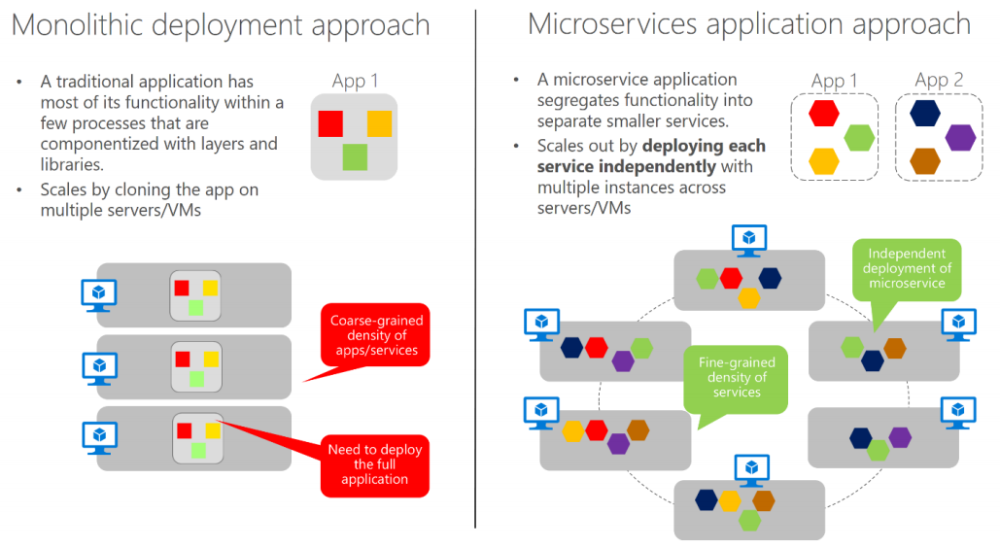

# Microservices architecture

As the name implies, a microservices architecture is an approach to building a server application as a set of small services. That means a microservices architecture is mainly oriented to the back-end, although the approach is also being used for the front end. Each service runs in its own process and communicates with other processes using protocols such as HTTP/HTTPS, WebSockets, or AMQP. Each microservice implements a specific end-to-end domain or business capability within a certain context boundary, and each must be developed autonomously and be deployable independently. Finally, each microservice should own its related domain data model and domain logic \(sovereignty and decentralized data management\) and could be based on different data storage technologies \(SQL, NoSQL\) and different programming languages

What size should a microservice be? When developing a microservice, size shouldn’t be the important point. Instead, the important point should be to create loosely coupled services so you have autonomy of development, deployment, and scale, for each service. Of course, when identifying and designing microservices, you should try to make them as small as possible as long as you don’t have too many direct dependencies with other microservices. More important than the size of the microservice is the internal cohesion it must have and its independence from other services.

Why a microservices architecture? In short, it provides long-term agility. Microservices enable better maintainability in complex, large, and highly-scalable systems by letting you create applications based on many independently deployable services that each have granular and autonomous lifecycles.

As an additional benefit, microservices can scale out independently. Instead of having a single monolithic application that you must scale out as a unit, you can instead scale out specific microservices. That way, you can scale just the functional area that needs more processing power or network bandwidth to support demand, rather than scaling out other areas of the application that don’t need to be scaled. That means cost savings because you need less hardware.

