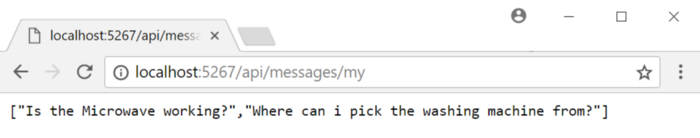
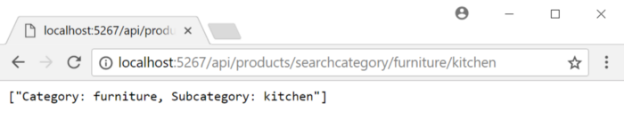
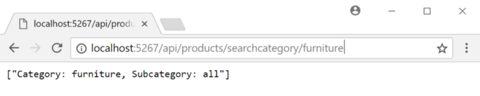

# Routing

## Routing

Routing in ASP.NET Core is the process of mapping incoming requests to application logic that resides in controllers and methods.

ASP.NET Core maps the incoming request based on the routes that you configure in your application, and for each route, you can set specific configurations, such as default values, message handlers, constraints, and so on.

There are a few ways of controlling the routing in an ASP.NET Core application, but in this article, we will concentrate on the two most common ways:

* **Conventional routing**: The route is determined based on conventions that are defined in route templates that, at runtime, will map requests to controllers and actions \(methods\).
* **Attribute-based routing**: The route is determined based on attributes that you set on your controllers and methods. These will define the mapping to the controller’s actions.

### Conventional routing

In the conventional routing style, during application startup, you define route templates that will be queried each time an incoming request is received in order to make a URL matching. This process will eventually map to a controller and a method inside it. If no route is found for the incoming request, an HTTP error of 404 \(Not Found\) will be returned to the caller.

When you called `AddMvc` inside the `ConfigureServices` method and the `UseMvcWithDefaultRoute` method inside the `Configure` method in your startup class, at the same time, behind the scenes, the MVC framework added a route handler and set the route to the default template, which looks like this:

`"{controller=Home}/{action=Index}/{id?}"`

This template defines that for every request that is received, the request pipeline will attempt to break its URL so that the first part will be mapped to the controller name, the second part \(the one after the `/`\) will be mapped to the method inside the controller, and the third part, if it exists, will be used as a route parameter \(enclosed in curly braces `{}`\) to map to a parameter with the id method.

When ASP.NET Core searches for a controller, it takes the controller part from the template and concatenates it with the suffix controller. This means that, instead of using a URL in the form of `/ExampleController/SomeAction`, you can just write `/Example/SomeAction`.

#### Defining a new route template

To define route templates in your application, the easiest way is to use the `UseMvc` method, instead of `UseMvcWithDefaultRoute` inside the `Configure` method in your startup class. This method allows you to define the routes you want in your application. For example, in the `GiveNTake` application, if we want our application to support not only the default route, but also expose the RESTful API with an api prefix \(that is, URLs in the form of `/api/[controller]/[action]`\), then this is how we need to change our `Configure` method:

```csharp
public void Configure(IApplicationBuilder app, IHostingEnvironment env)
{
   app.UseMvc(routes =>
   {
       routes
           .MapRoute(name: "default", template: "{controller=Home}/{action=Index}/{id?}")
           .MapRoute(name: "api", template: "api/{controller}/{action}/{id?}");
   });
}
```

The `MapRoute` method is how you can define routes for your application, and you can call it multiple times to set multiple route templates.

To test the route you just configured, add a new empty class in the `Controllers` folder and name it `MessagesController`. Paste the following code to the file you created. It should look something like the following:

```csharp
    public class MessagesController : Controller
    {
        public string[] My()
        {
            return new[]
            {
                "Is the Microwave working?",
                "Where can i pick the washing machine from?",
            };
        }
        public string Details(int id)
        {
            return $"{id} - Is the Microwave working?";
        }
    }
```

Run the project and navigate your browser to `http://localhost:{port}/api/messages/my`. Your browser should display a page similar to this:



The `MapRoute` methods allow you to control the route in a more advanced way. Here is the full `MapRoute` signature, but it has overloads that make some of the parameters optional:

```csharp
IRouteBuilder MapRoute(this IRouteBuilder routeBuilder, 
    string name, 
    string template, 
    object defaults, 
    object constraints, 
    object dataTokens)
```

These parameters operate as follows:

* **name**: Each route should be given a unique name that identifies it. The name doesn't affect the routing procedure, but it can be very useful when there are route failures, and ASP.NET Core notifies you on issues with the routes.
* **template**: This is the core of the route. This defines the URL structure and the tokens that should be mapped to the controller, actions, and parameters.
* **defaults**: This defines the default values for the different tokens in case they are missing in the request URL.
* **constraints**: This parameter covers individual constraint rules for the tokens in the route that determine if the value is acceptable for that token in that route.
* **data token**: These are additional values that are associated with the route. They won't affect the matching process, but when the route is determined, the values will be added to the RouteData.DataTokens collection property of the controller and can be used in its logic.

Here is an improved Version of our API route definition that sets the default value for the controller to `Messages`, the action to `My`, and also sets a constraint on the id parameter to allow only integers:

```csharp
MapRoute(
   name: "api", 
   template: "api/{controller}/{action}/{id?}",
   defaults: new { Controller = "Messages", action="My" },
   constraints: new { id = new IntRouteConstraint() });
```

`defaults` and `constraints` can also be set inside the template itself, so the preceding API definition we created is identical to this one:

```csharp
MapRoute(
   name: "api",
   template: "api/{controller=Messages}/{action=My}/{id:int?}");
```

Conventional routing is a simple mechanism that is usually suited to small-scale APIs. But as your APIs grow, you will soon find that you need a more fine-grained approach for defining your routes, and if that’s the case, it’s better to use attribute-based routing.

### Attribute-based routing

Attribute-based routing allows you to control the exact route that each controller and action takes part in by using the attributes that decorate your controllers and methods. I recommend that you use this approach for most of your APIs, since it will make your code more explicit and reduce routing errors that might be introduced as you add more controllers and actions.

The `ProductsController` looks like this:

```csharp
[Route("api/Products")]
[ApiController]
public class ProductsController : Controller
{
    ...   
}
```

The `RouteAttribute` attribute that decorates the `ProductController` contains the URL template that maps to this controller. In this case, every request with a URL prefixed with `/api/products/` will be routed to this controller. You can use the `RouteAttribute` attribute on controllers and on methods, but for methods, it's recommended to use the `Http[Verb]Attribute` attribute, where `[Verb]` is one of the standard HTTP verbs \(Get, Post, Put, Delete, and so on\).

The `Http[Verb]Attribute` and `RouteAttribute` attributes can be assigned multiple times to define multiple routes, and are hierarchical, which means that they support route inheritance. This means that if you configured a route on your controller, the routes you define on the methods will extend it.

For example, here is how you can configure that the `ProductsController.GetProducts` method will be mapped to a `HttpGet` request to the URL `/api/products/all`, in addition to the URL `/api/products`:

```csharp
[HttpGet]
[HttpGet("all")]
public string[] GetProducts()
{
    ...    
}
```


If the `Http[Verb]Attribute` that you set on a method contains a string that begins with `/`, then it won't be combined with the route defined in the controller, and will instead define a route of its own.


#### Parameterizing the route template

Attribute-based routing supports a few predefined tokens that are placed in square brackets \(`[` and `]`\), and will be replaced at runtime with their corresponding value:

* `[controller]`: This will be replaced with the controller name.
* `[action]`: This will be replaced with the method name.
* `[area]`: If your application supports areas, this will be replaced with the area in which the controller resides.

For example, instead of writing `ProductsController` explicitly in the `RouteAttribute`, we can write it like this:

```csharp
[Route("api/[controller]")]
[ApiController]
public class ProductsController : Controller
{
    ...
}
```

Tokens within curly braces \(`{}`\) define route parameters that will be bound to the method parameters if the route is matched.

For example, suppose you wish to expose an API to search for products, based on a keyword, in the form of a GETrequest to a URL formatted as `/api/products/search/keyword`. This is how you can write it:

```csharp
[HttpGet("search/{keyword}")]
public string[] SearchProducts(string keyword)
{
    ...
}
```

Just like with conventional routing, you can define default values and constraints on the route parameters.

#### Default values

Default values are defined by placing an equals sign next to the route parameter. Note that placing default values on the method parameters \(not in the root template\) will not work, as the routing pipeline is unable to find a match by looking at optional parameters.

For example, the `GiveNTake` application allows the user to search for products by specifying a category and a sub-category; however, the sub-category is optional, and if it is omitted, the default `subcategory` will be `all`. The following code snippet shows you how to define these rules:

```csharp
[HttpGet("searchcategory/{category}/{subcategory=all}/")]
public string[] SearchByProducts(string category,string subcategory)
{
    return new[]
    {
        $"Category: {category}, Subcategory: {subcategory}"
    };
}
```

Run the application and navigate to`http://localhost/api/products/searchcategory/furniture/kitchen`, and then to `http://localhost/api/products/searchcategory/furniture`.

For the first URL, you should see results similar to the following:



And the second URL should produce an output like this:



#### Constraints

Inline constraints inside the routing attributes are used by placing a colon with the constraint name :constraint-name after the route parameter name, where constraint-name is a constraint that you define by creating a class that implements the IRouteConstraint interface, or simply by using one of the built-in constraints specified in the ASP.NET documentation.

The following example shows how we can add a `search` method to our `ProductsController` that searches by the date that the product was posted online. The URL for this action must constrain the date parameter to `datetime` formats only; therefore, we will use the `datetime`constraint like this:

```csharp
[HttpGet("search/{date:datetime}/{keyword}/")]
public string[] Search(string date, string keyword)
{
    return new[]
    {
        $"Date: {date}, keyword: {keyword}"
    };
}
```

The routing infrastructure in ASP.NET Core is very sophisticated, and there are plenty more features out of the scope of this book that therefore aren’t covered. For more details about the routing capabilities in ASP.NET Core, refer to the documentation at [https://docs.microsoft.com/en-us/aspnet/core/fundamentals/routing](https://docs.microsoft.com/en-us/aspnet/core/fundamentals/routing).

