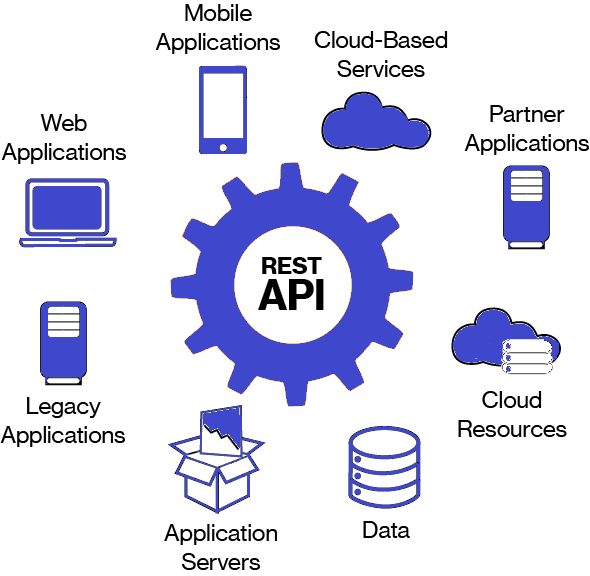

# REST

### REPRESENTATIONAL STATE TRANSFER

REST, or REpresentational State Transfer, is an architectural style for providing standards between computer systems on the web, making it easier for systems to communicate with each other. REST-compliant systems, often called RESTful systems, are characterized by how they are stateless and separate the concerns of client and server. We will go into what these terms mean and why they are beneficial characteristics for services on the Web. 

REST allows you to interact with minimal overhead with clients as diverse as mobile phones and other websites. In theory, REST is not tied to the web, but it's almost always implemented as such, and was inspired by HTTP. As a result, REST can be used wherever HTTP can.

### SEPARATION OF CLIENT AND SERVER

In the REST architectural style, the implementation of the client and the implementation of the server can be done independently without each knowing about the other. This means that the code on the client side can be changed at any time without affecting the operation of the server, and the code on the server side can be changed without affecting the operation of the client.

As long as each side knows what format of messages to send to the other, they can be kept modular and separate. Separating the user interface concerns from the data storage concerns, we improve the flexibility of the interface across platforms and improve scalability by simplifying the server components. Additionally, the separation allows each component the ability to evolve independently.

By using a REST interface, different clients hit the same REST endpoints, perform the same actions, and receive the same responses.

### STATELESSNESS

Systems that follow the REST paradigm are stateless, meaning that the server does not need to know anything about what state the client is in and vice versa. In this way, both the server and the client can understand any message received, even without seeing previous messages. This constraint of statelessness is enforced through the use of resources, rather than commands. Resources are the nouns of the Web - they describe any object, document, or thing that you may need to store or send to other services.

Because REST systems interact through standard operations on resources, they do not rely on the implementation of interfaces.

These constraints help RESTful applications achieve reliability, quick performance, and scalability, as components that can be managed, updated, and reused without affecting the system as a whole, even during operation of the system.

Now, we’ll explore how the communication between the client and server actually happens when we are implementing a RESTful interface.

### COMMUNICATION BETWEEN CLIENT AND SERVER

In the REST architecture, clients send requests to retrieve or modify resources, and servers send responses to these requests. Let’s take a look at the standard ways to make requests and send responses.

#### MAKING REQUESTS

REST requires that a client make a request to the server in order to retrieve or modify data on the server. A request generally consists of:

* an HTTP verb, which defines what kind of operation to perform
* a header, which allows the client to pass along information about the request
* a path to a resource
* an optional message body containing data

#### HTTP VERBS

There are 4 basic HTTP verbs we use in requests to interact with resources in a REST system:

* GET — retrieve a specific resource \(by id\) or a collection of resources
* POST — create a new resource
* PUT — update a specific resource \(by id\)
* DELETE — remove a specific resource by id

#### HEADERS AND ACCEPT PARAMETERS

In the header of the request, the client sends the type of content that it is able to receive from the server. This is called the Accept field, and it ensures that the server does not send data that cannot be understood or processed by the client. The options for types of content are MIME Types \(or Multipurpose Internet Mail Extensions.

MIME Types, used to specify the content types in the Accept field, consist of a type and a subtype. They are separated by a slash \(/\).

For example, a text file containing HTML would be specified with the type text/html. If this text file contained CSS instead, it would be specified as text/css. A generic text file would be denoted as text/plain. This default value, text/plain, is not a catch-all, however. If a client is expecting text/css and receives text/plain, it will not be able to recognize the content.

Other types and commonly used subtypes:

* image — image/png, image/jpeg, image/gif
* audio — audio/wav, image/mpeg
* video — video/mp4, video/ogg
* application — application/json, application/pdf, application/xml, application/octet-stream

#### PATHS

Requests must contain a path to a resource that the operation should be performed on. In RESTful APIs, paths should be designed to help the client know what is going on.

Conventionally, the first part of the path should be the plural form of the resource. This keeps nested paths simple to read and easy to understand.

Paths should contain the information necessary to locate a resource with the degree of specificity needed. When referring to a list or collection of resources, it is unnecessary to add an id to a POST request to a fashionboutique.com/customers path would not need an extra identifier, as the server will generate an id for the new object.

If we are trying to access a single resource, we would need to append an id to the path. For example: GET fashionboutique.com/customers/:id — retrieves the item in the customers resource with the id specified. DELETE fashionboutique.com/customers/:id — deletes the item in the customers resource with the id specified.

### SENDING RESPONSES

#### CONTENT TYPES

In cases where the server is sending a data payload to the client, the server must include a content-type in the header of the response. This content-type header field alerts the client to the type of data it is sending in the response body. These content types are MIME Types, just as they are in the accept field of the request header. The content-type that the server sends back in the response should be one of the options that the client specified in the accept field of the request.

#### RESPONSE CODES

* 200 \(OK\) - This is the standard response for successful HTTP requests. 
* 201 \(CREATED\) - This is the standard response for an HTTP request that resulted in an item being successfully created. 
* 204 \(NO CONTENT\) - This is the standard response for successful HTTP requests, where nothing is being returned in the response body. 
* 400 \(BAD REQUEST\) - The request cannot be processed because of bad request syntax, excessive size, or another client error. 
* 403 \(FORBIDDEN\) - The client does not have permission to access this resource. 
* 404 \(NOT FOUND\) - The resource could not be found at this time. It is possible it was deleted, or does not exist yet. 
* 500 \(INTERNAL SERVER ERROR\) - The generic answer for an unexpected failure if there is no more specific information available.

