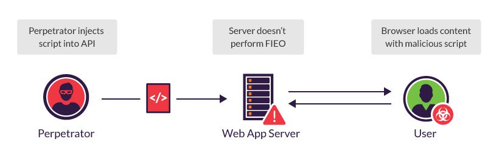

# Web API Security

## API security threats

APIs often self-document information, such as their implementation and internal structure, which can be used as intelligence for a cyber-attack. Additional vulnerabilities, such as weak authentication, lack of encryption, business logic flaws and insecure endpoints make APIs vulnerable to the attacks outlined below.

### Man In The Middle \(MITM\)

A man in the middle \(MITM\) attack involves an attacker secretly relaying, intercepting or altering communications, including API messages, between two parties to obtain sensitive information.

For example, a perpetrator can act as a man in the middle between an API issuing a session token in an HTTP header and a user’s browser. Intercepting that session token would grant access to the user’s account, which might include personal details, such as credit card information and login credentials.

### API injections \(XSS and SQLi\)

In a code injection attack, malicious code is inserted into a vulnerable software program to stage an attack, such as cross site scripting \(XSS\) and SQL injection \(SQLi\).



For example, a perpetrator can inject a malicious script into a vulnerable API, i.e., one that fails to perform proper filter input, escape output \(FIEO\), to launch an XSS attack targeting end users’ browsers. Additionally, malicious commands could be inserted into an API message, such as an SQL command that deletes tables from a database.

Any web API requiring parsers or processers is vulnerable to attack. For example, a code generator that includes parsing for JSON code, and doesn’t sanitize input properly, is susceptible to the injection of executable code that runs in the development environment.

### Distributed denial of service \(DDoS\)

In a distributed denial-of-service \(DDoS\) attack, multiple systems flood the bandwidth or resources of a targeted system, usually one or more web servers. A DDoS attack on a web API attempts to overwhelm its memory and capacity by flooding it with concurrent connections, or by sending/requesting large amounts of information in each request.

For example, a DDoS attack on the FCC website in early 2017 used commercial cloud services to issue a massive amount of API requests to a commenting system. This consumed available machine resources and crowded out human commenters, eventually causing the website to crash.

## API security best practices

Securing your API against the attacks outlined above should be based on:


**Authentication** – Determining the identity of an end user. In a REST API, basic authentication can be implemented using the TLS protocol, but OAuth 2 and OpenID Connect are more secure alternatives.



**Authorization** – Determining the resources an identified user can access. An API should be built and tested to prevent users from accessing API functions or operations outside their predefined role. For example, a read-only API client shouldn’t be allowed to access an endpoint providing admin functionality.


#### Keep it Simple

Secure an API/System – just how secure it needs to be. Every time you make the solution more complex “unnecessarily”, you are also likely to leave a hole.

#### Always Use HTTPS

By always using SSL, the authentication credentials can be simplified to a randomly generated access token that is delivered in the username field of HTTP Basic Auth. It’s relatively simple to use, and you get a lot of security features for free.

If you use HTTP 2, to improve performance – you can even send multiple requests over a single connection, that way you avoid the complete TCP and SSL handshake overhead on later requests.

#### Use Password Hash

Passwords must always be hashed to protect the system \(or minimize the damage\) even if it is compromised in some hacking attempt. There are many such hashing algorithms which can prove really effective for password security e.g. SHA2, PBKDF2, bcrypt and scrypt algorithms.

#### Never expose information on URLs

Usernames, passwords, session tokens, and API keys should not appear in the URL, as this can be captured in web server logs, which makes them easily exploitable.

```text
https://api.domain.com/user-management/users/{id}/someAction?apiKey=abcd123456789  //Very BAD !!
```

Above URL exposes API key So, never use this form of security.

#### Consider OAuth

Though basic auth is good enough for most of the APIs and if implemented correctly, it’s secure as well – yet you may want to consider OAuth as well. The OAuth 2.0 authorization framework enables a third-party application to obtain limited access to an HTTP service, either on behalf of a resource owner by orchestrating an approval interaction between the resource owner and the HTTP service, or by allowing the third-party application to obtain access on its own behalf.

#### Consider Adding Timestamp in Request

Along with other request parameters, you may add a request timestamp as HTTP custom header in API request. The server will compare the current timestamp to the request timestamp, and only accepts the request if it is within a reasonable timeframe \(1-2 minutes, perhaps\).

This will prevent very basic replay attacks from people who are trying to brute force your system without changing this timestamp.

#### Input Parameter Validation

Validate request parameters on the very first step, before it reaches to application logic. Put strong validation checks and reject the request immediately if validation fails. In API response, send relevant error messages and example of correct input format to improve user experience.

#### WAF

A web application firewall \(WAF\) applies a set of rules to an HTTP/S conversations between applications. WAFs are commonly used to secure API platforms, as they are able to prevent misuse and exploitation and helps mitigate application-layer DDoS attacks. 

In addition, WAFs use a list of regularly-patched, strict signatures and SSL/TLS encryption to block injection attacks and prevent the interception of site traffic in MITM attacks.

