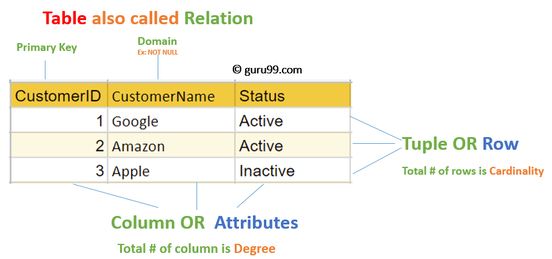

# Relational terminology: Attributes


Your system will need to keep track of certain facts about each entity. These facts are referred to as the entity's **attributes**.


If your system includes Customer entities, for example, you'll probably want to know the names and addresses of the customers and perhaps the businesses they're in.

