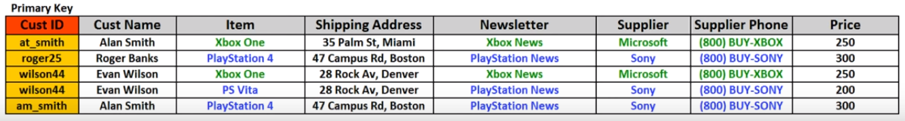
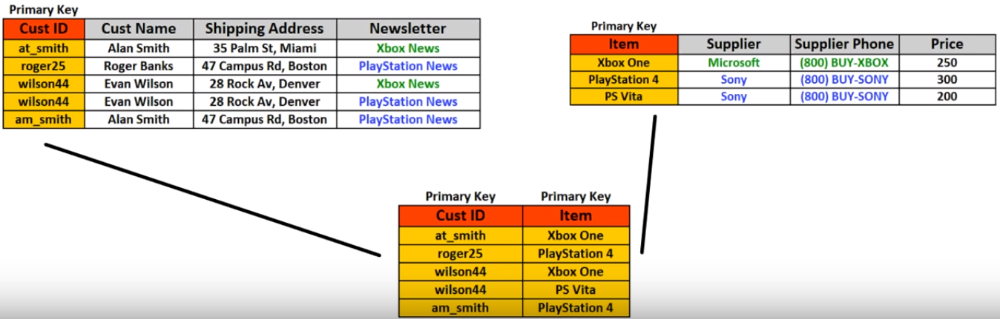
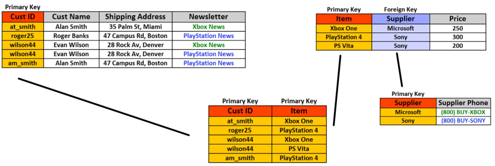
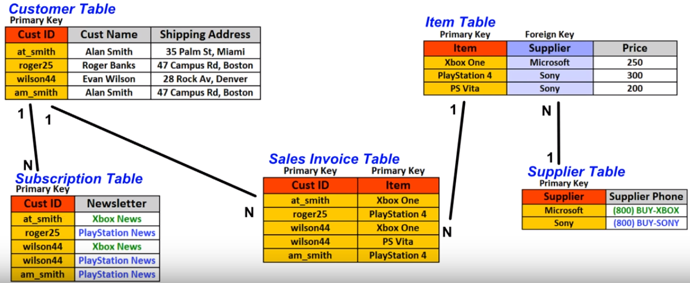

# Understanding normalization concept


**Database normalization** is the process of structuring a relational database in accordance with a series of so-called normal forms in order to reduce data redundancy and improve data integrity.


Normalization entails organizing the columns \(attributes\) and tables \(relations\) of a database to ensure that their dependencies are properly enforced by database integrity constraints.

### Side effects

**Side-effects** may arise in relations that have not been sufficiently normalized:

* **Update anomaly** \(change may need to be applied to multiple records; if update partially successful – data inconsistency appears\)

* **Insertion anomaly** \(all attributes should be filled during insertion; if not – data integrity compromised\)

* **Deletion anomaly** \(deletion of data representing certain facts necessitates deletion of data representing completely different facts\)

### Normalization Forms

#### **UNF - Unnormalized form**

#### **1NF - First normal form**

* Each sell to be Single valued
* Entries in a column are same type
* Rows uniquely identified \(add Unique ID or add more columns to make unique\)

#### **2NF - Second normal form**

* 1st normal form
* All attributes \(Non-Key Columns\) dependent on the key

#### **3NF - Third normal form**

* 2nd normal form
* All fields \(columns\) can be determined Only by the Key in the table and no other column

#### **4NF - Fourth normal form**

* 3rd normal form
* No multi-valued dependencies

