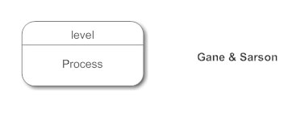
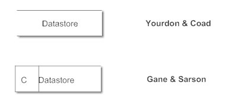
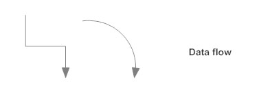
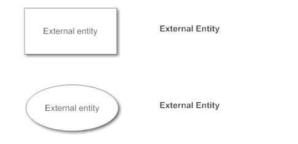

# Data Flow Diagrams


A **data flow diagram \(DFD\)** illustrates how data is processed by a system in terms of inputs and outputs. As its name indicates its focus is on the flow of information, where data comes from, where it goes and how it gets stored.


There are essentially two different types of notations for data flow diagrams \(Yourdon & Coad or Gane & Sarson\) defining different visual representations for processes, data stores, data flow and external entities.

Yourdon and Coad type data flow diagrams are usually used for system analysis and design, while Gane and Sarson type DFDs are more common for visualizing information systems.

Visually, the biggest difference between the two ways of drawing data flow diagrams is how processes look. In the Yourdon and Coad way, processes are depicted as circles, while in the Gane and Sarson diagram the processes are squares with rounded corners.

### Data Flow Diagram **Notations**

#### **Process Notations**

A process transforms incoming data flow into outgoing data flow.

#### **Datastore Notations**

Datastores are repositories of data in the system. They are sometimes also referred to as files.

#### **Dataflow Notations**

Dataflows are pipelines through which packets of information flow. Label the arrows with the name of the data that moves through it.

#### **External Entity Notations**

External entities are objects outside the system, with which the system communicates. External entities are sources and destinations of the system's inputs and outputs.

### Data Flow Diagram Levels

* **Context Diagram**. A context diagram is a top level \(also known as "Level 0"\) data flow diagram. It only contains one process node \("Process 0"\) that generalizes the function of the entire system in relationship to external entities.
* **DFD Layers**. Draw data flow diagrams can be made in several nested layers. A single process node on a high level diagram can be expanded to show a more detailed data flow diagram. Draw the context diagram first, followed by various layers of data flow diagrams.
* **DFD Levels**. The first level DFD shows the main processes within the system. Each of these processes can be broken into further processes until you reach pseudo code.

### Example

