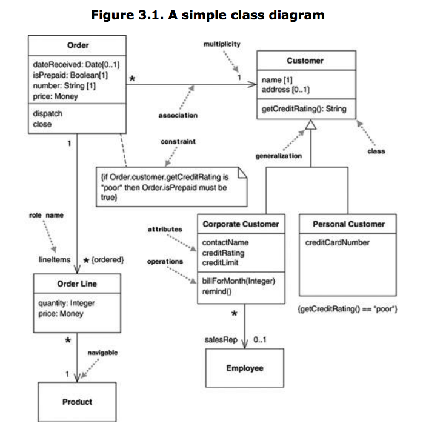

# UML: Class Diagram \(Essentials\)


A **class diagram** describes the types of objects in the system and the various kinds of static relationships that exist among them. Class diagrams also show the properties and operations of a class and the constraints that apply to the way objects are connected.


The UML uses the term feature as a general term that covers properties and operations of a class.

The boxes in the diagram are classes, which are divided into three compartments: the name of the class \(in bold\), its attributes, and its operations. also shows two kinds of relationships between classes: associations and generalizations.

More specifically, each class has 3 fields: the class name at the top, the class attributes right below the name, the class operations/behaviors at the bottom.

**Properties**: represent structural features of a class. As a first approximation, you can think of properties as corresponding to fields in a class.

**Attributes**: the attribute notation describes a property as a line of text within the class box itself.

**Associations**: much of the same information that you can show on an attribute appears on an association. This is the same properties represented in the two different notations.

