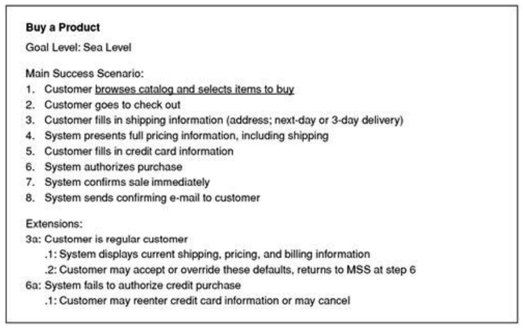
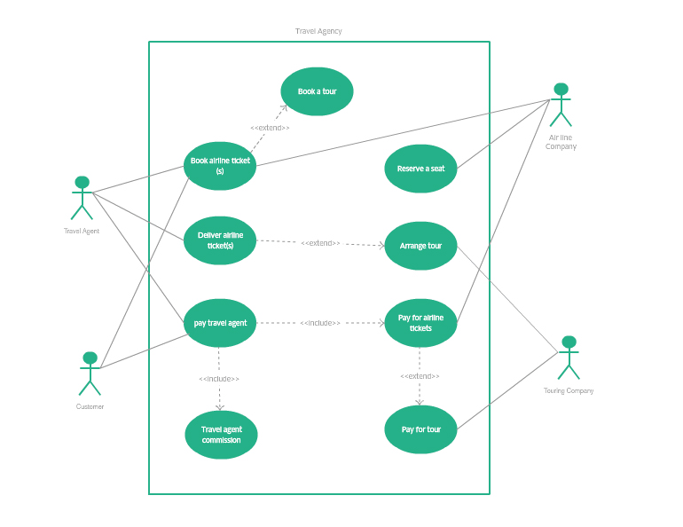

# UML: Use Case Diagram \(Essentials\)

Use cases are a technique for capturing the functional requirements of a system. Use cases work by describing the typical interactions between the users of a system and the system itself, providing a narrative of how a system is used.


A **scenario** is a sequence of steps describing an interaction between a user and a system



A **use case** is a set of scenarios tied together by a common user goal.


In use case–speak, the users are referred to as actors. An actor is a role that a user plays with respect to the system. Actors might include customer, customer service rep, sales manager, and product analyst.

