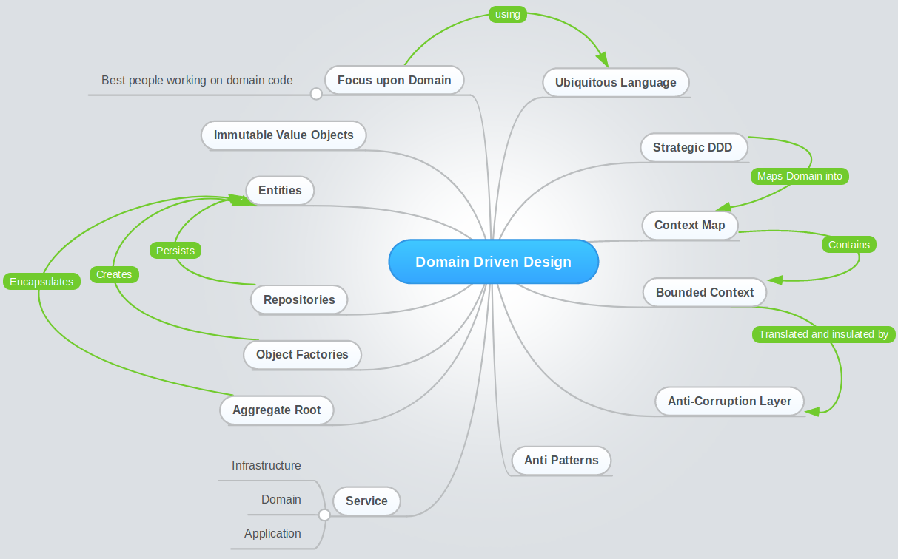
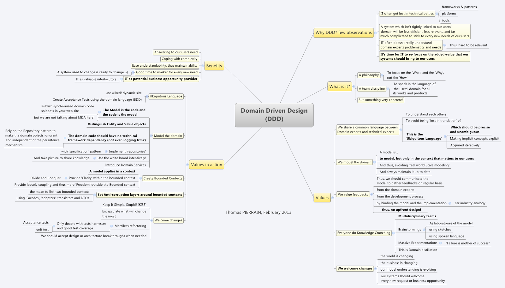
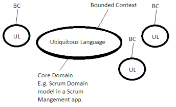
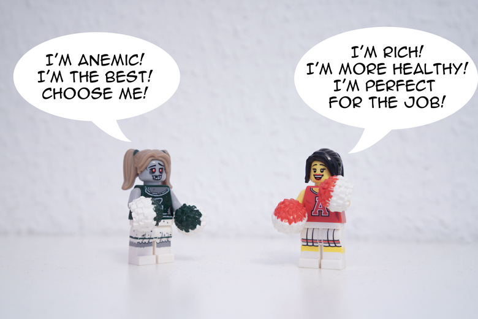

# Domain-Driven Design patterns

### Why Should You Care About Domain-Driven Design?

**Domain-driven design** is not a technology or a methodology. DDD provides a structure of practices and terminology for making design decisions that focus and accelerate software projects dealing with complicated domains.

1. IT often get lots in technical battles \(frameworks & patterns, platforms, tools\)
2. A system whuch isn't tightly linked to our users' domain will be less efficient, less relevant, and far much complicated to stick to every new needs of our users
3. IT often doesn't really understand domain experts problematics and needs
4. It's time for IT to re-focus on the added-value that our system should bring to our users

Point of DDD is to fight Big Ball of Mud architecture in a meaningful way. Big Ball of Mud architecture results in a large, unbound model, with an undefined domain language that overlaps.

### Benefits of DDD

1. Answering to our users need
2. Coping with complexity
3. Ease understandability, thus maintainability
4. Good time to market for every new need \(a system used to change is ready to change\)
5. IT as potential business opportunity provider \(IT as valuable interlocutors\)

### Drawbacks of DDD

In order to help maintain the model as a pure and helpful language construct, the team must typically **implement a great deal of isolation and encapsulation** within the domain model.

Consequently, a system based on domain-driven design can come at a relatively high cost. While domain-driven design provides many technical benefits, such as maintainability, Microsoft recommends that it be applied only to complex domains where the model and the linguistic processes provide clear benefits in the communication of complex information, and in the formulation of a common understanding of the domain.

### A Mind Map of DDD's Working Parts

### Sub-domain

* Subdomain is an area of expertise within a wider system.
* Each BC should be one subdomain. Try not to split BCs into multiple subdomains.
* Three types of subdomains:
  * Core Domain – BCs of vital strategic interest to the business
  * Supporting Domains – other business-related concepts that are important and serve to enrich the core domain.
  * Generic Subdomains – other concepts that don’t serve a direct purpose to the business but are here in a supporting role – these can be bought as off-the-shelf applications. Remember to implement them using an ACL.
* C\# namespace == subdomain.
* Name your Bounded Contexts!

### Bounded Context

In general a _bounded context_ is a boundary within which the ubiquitous language is consistent.

* a set of concepts that make sense to be grouped together. Business decides on which concepts belong together – boundaries are determined by uncovering how the domain works.
* One or several BCs the business considers to be of strategic, long-term value constitute the _Core Domain._

### Difference Between Sub-domain and Bounded Context

A _subdomain_ is a part of your business. There are core domains, supporting domains and generic domains. Core domains are where the money is, supporting domains support your core business, and generic domains are the ones you need, but don't care a lot about, so you would probably buy them of the shelf.

For an insurance company, the core domain is insurance, a supporting domain could be client portfolio, and a generic domain could be something like timesheets.

In general a _bounded context_ is a boundary within which the ubiquitous language is consistent. In DDD walhalla each subdomain would live in its own bounded context. In reality however, there is legacy, there are packages that try to do everything at once... which will force all kinds of awkard relationships.

### Understanding Context Maps

* Context Mapping allows for BCs to talk to each other. It is a way to integrate them.
* In essence it is a translation between two different ULs.
* Besides translating, it also serves to describe the relationship between the teams assigned to BCs involved.

#### Types of mapping:

* **Shared kernel**: a part of model is shared between the teams. Hard to maintain, a strain on teams, hampers further development of UL since teams are bound together and must coordinate.
* **Partnership**: two teams agree that they will synchronize their ULs and all planned work. Nothing is shared, simply synchronized. Tough to maintain.
* **Customer-Supplier** \(Downstream-Upstream\): Supplier acts as a service providing the necessary resources to the Customer. Supplier must provide resources that are of value to the Customer. This is a profitable relationship type for both teams as long as the Supplier is responsive to Customer’s real needs.
* **Anti-corruption layer** \(ACL\): a translation layer on the customer’s side. It prevents customer’s BC becoming infected with supplier’s model.
* **Open host service** \(OHS\): a well-defined and well-described protocol or interface through which customer can access resources provided by the supplier’s BC. It is called “open” because it is well-described and those that wish to integrate can easily do so.
* **Published Language** \(PL\): A well-defined information exchange language. OHS serves and consumes PL. Usually in the form of JSON or XML. Think of it as an intermediary language between supplier’s and consumer’s UL.
* **Conformist**: downstream team cannot sustain the effort of developing an ACL and decides to embrace the upstream’s PL.
* **Separate ways**: no BC of interest exists and team decides to develops its own solution within its BC.
* **Big Ball of Mud**: a growing number of aggregates cross-contaminate the model, creating unwanted dependencies. Changes cause rippling effects throughout the system, threatening to break the app. Tribal knowledge and speaking multiple ULs at once save the system from collapsing.

### The Ubiquitous Language of a Bounded Context

The concept is simple, that developers and the business should share a **common language that both understand** to mean the same things, and more importantly, that is set in business terminology, not technical terminology.

A language structured around the domain model and used by all team members to connect all the activities of the team with the software.

* describes the model within a single BC.
* this, in fact, **is** the model. Having a UL allows you to develop the model further.
* UL is a product of iterative talks between developers and domain experts. It is, in turn, a way for developers and domain experts to further talk about a business concept and understand each other fully.
* It is vital to understand that UL evolves over time as our understanding of the business evolves and as the business itself changes

### Anemic and Rich Models

#### In an Anemic Domain Model:

* The **domain objects** \(also called **models**\) are only pure data structures. Almost no logic is implemented there.
* The **services** set model’s properties via setters and define the logic of your application.

#### With the Rich Domain Model:

* All the domain logic is implemented in **real domain objects**
* The **service layer** is thin and used only for third party services.

### Entities in DDD and in Our Bounded Context

An object that is not defined by its attributes, but rather by a thread of continuity and its identity.

The key defining characteristic of an **Entity** is that it has an _Identity_ – it is unique within the system, and no other Entity, no matter how similar is, the same Entity unless it has the same Identity.

Example: Most airlines distinguish each seat uniquely on every flight. Each seat is an entity in this context. However, Southwest Airlines, EasyJet and Ryanair do not distinguish between every seat; all seats are the same. In this context, a seat is actually a value object.

### Value Objects

**Value object** contains attributes but has _no conceptual identity_. They should be treated as _immutable_.

Two value objects may have identical attributes, in which case they are identical.

Example: When people exchange business cards, they generally do not distinguish between each unique card; they are only concerned about the information printed on the card. In this context, business cards are value objects.

### Domain Services

Some concepts from the domain aren’t natural to model as objects. Forcing the required domain functionality to be the responsibility of an entity or value either distorts the definition of a model-­‐based object or adds meaningless artificial objects.

So, when an operation _does not conceptually belong to any object_, you can implement it in **service**.

### Aggregates and Aggregate Roots

A collection of objects that are bound together by a root entity, otherwise known as an **aggregate root**. The aggregate root guarantees the consistency of changes being made within the aggregate by forbidding external objects from holding references to its members.

Example: When you drive a car, you do not have to worry about moving the wheels forward, making the engine combust with spark and fuel, etc.; you are simply driving the car. In this context, the car is an aggregate of several other objects and serves as the aggregate root to all of the other systems.

Aggregate Roots have APIs through which we change internal state of an aggregate – they must never be in an invalid state. There are two approaches that you can use here:

1. One large API on your Aggregate Root. You do not reference non-root entities, but rather change state through Aggregate Root. This approach may make for larger API on the root, which might lead you to break up your root into multiple root – such a fragmented representation might not reflect the business accurately.
2. Allow clients to hold _transient_ references to non-root entities – only for one operation and within a single block of code

### Repositories

Methods for retrieving domain objects should delegate to a specialized **Repository** object such that alternative storage implementations may be easily interchanged.

Repository Mediates between the domain and data mapping using a collection-like interface for accessing domain objects. It is more like a facade to your data store that pretend like a collection of your domain.

_Repository Is Not A Data Access Layer._

### Domain Events

A **domain event** is a full-­‐fledged part of the domain model, a representation of something that happened in the domain. A domain event is an event that domain experts care about.

Domain events are ordinarily _immutable_, as they are a record of something in the past. In addition to a description of the event, a domain event typically contains a timestamp for the time the event occurred and the identity of entities involved in the event. Also, a domain event often has a separate timestamp indicating when the event was entered into the system and the identity of the person who entered it.

