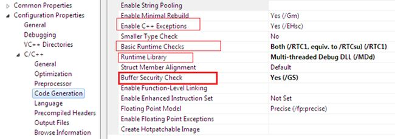
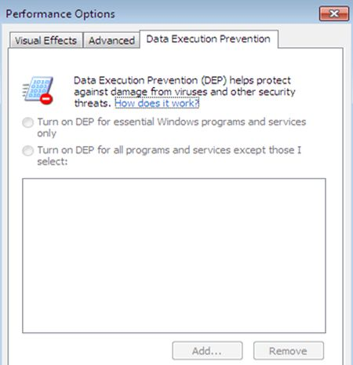

# Protecting against buffer overrun attacks

### Buffer overrun types

Although many overflows occurs when the program receives more data than it expects, in fact there are many kinds of overflows. It is important to distinguish among various classes of overflows to be able to develop good test cases to identify specific types of overflows:

* **Integer overflow:** Occurs when a specific data type of a CPU register that is meant to hold values within a certain range is to be assigned a value outside that range. Integer overflow often leads to buffer overflow for cases in which integer overflow occurs when computing the size of the memory to allocate.
* **Stack Overflows:** such overflows occur when data is written past the end of buffers allocated on the stack.
* **Heap Overflow:** It occurs when data is written outside the space that was allocated for it on the heap. 
* **Format String Attacks:** Format String attacks occur when the %n parameter of the format string is used to write data outside the target buffer.

### **Protection Mechanisms**

**For C++**

We must to enable these compiler checks at least**:**

* Buffer Security check \(/GS\)
* Runtime Library check \(Both /RTC1…\)
* Basic Runtime checks \(Enable VC++ Run time Library\)
* DEP



Also in Windows settings:



#### **For C\#**

Yes, buffer overflow exploits are still possible in C\#, but they are much harder to produce. You can only get buffer overflows if you use certain unsafe constructs, and not with "normal" C\# code. Memory corrupting code shouldn't be possible at all, when your code is running with lowered trust.

A few possibilities for buffer overflows:

1. Using the `unsafe` keyword, which allows pointers. Unsafe code is just as easy to get wrong, as pointer based code in c or c++.
2. Using unsafe APIs, such as the methods from the `Marshal` class
3. \(Mono only\) You can disable array range checking \(safety vs. performance trade-off\)

```csharp
unsafe void bufferOverflow(string s)
{
    char* ptr = stackalloc char[10];

    foreach (var c in s)
    {
        *ptr++ = c; // Bufferoverflow if s.Length > 10
    }
}
```

You can't a traditional buffer-overflow with an array. It will do bounds-checking before accessing an array unless it \(CLR\) can guarantee it is safe.


