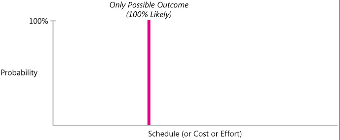

# Estimates, Targets, and Commitments

### Estimate


**Estimate** is a prediction of how long a project will take or how much it will cost. But estimation on software projects interplays with business targets, commitments, and control.


_Estimation_ and _planning_ are related topics, but **estimation is not planning**. Estimation should be treated as an unbiased, analytical process; planning should be treated as a biased, goal-seeking process. With estimation, it's hazardous to want the estimate to come out to any particular answer. The goal is accuracy; the goal is not to seek a particular result. But the goal of planning is to seek a particular result. We deliberately \(and appropriately\) bias our plans to achieve specific outcomes. We plan specific means to reach a specific end.

Estimates form the foundation for the plans, but the **plans don't have to be the same as the estimates**. If the estimates are dramatically different from the targets, the project plans will need to recognize that gap and account for a high level of risk. If the estimates are close to the targets, then the plans can assume less risk.

#### How to estimate?

Software estimates are routinely presented as single-point numbers, such as "This project will take 14 weeks." Such simplistic **single-point estimates are meaningless** because they don't include any indication of the probability associated with the single point.

In realistic estimate there is a limit to how well a project can go but no limit to how many problems can occur.

When you see a single-point estimate, that number's probability is not 100%. Ask what the probability of that number is.

#### Good estimate

A good estimate is an estimate that provides a clear enough view of the project reality to allow the project leadership to make good decisions about how to control the project to hit its targets.

### Target


**Target** is a statement of a desirable business objective.


#### Examples

* "We need to have this release stabilized in time for the holiday sales cycle."
* "These functions need to be completed by July 1 so that we'll be in compliance with government regulations."
* "We must limit the cost of the next release to $2 million, because that's the maximum budget we have for that release."

Businesses have important reasons to establish targets independent of software estimates. But the fact that a target is desirable or even mandatory does not necessarily mean that it is achievable.

### Commitment


**Commitment** is a promise to deliver defined functionality at a specific level of quality by a certain date.


A commitment can be the same as the estimate, or it can be more aggressive or more conservative than the estimate. In other words, do not assume that the commitment has to be the same as the estimate; it doesn't.

