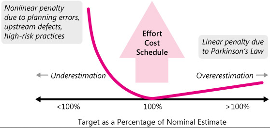

# Overestimate vs Underestimate

### **Overestimate**

If you give a developer 5 days to deliver a task that could be completed in 4 days, the developer will find something to do with the extra day. If you give a project team 6 months to complete a project that could be completed in 4 months, the project team will find a way to use up the extra 2 months. As a result, some managers consciously squeeze the estimates to try to avoid _Parkinson's Law_.

Another concern is "_Student Syndrome_" \(Goldratt 1997\). If developers are given too much time, they'll procrastinate until late in the project, at which point they'll rush to complete their work, and they probably won't finish the project on time.

### **Underestimation**

* **Reduced effectiveness of project plans.** Low estimates undermine effective planning by feeding bad assumptions into plans for specific activities. They can cause _planning errors in the team size_, such as planning to use a team that's smaller than it should be. They can undermine the ability to coordinate among groups—if the groups aren't ready when they said they would be, other _groups won't be able to integrate_ with their work.
* **Statistically reduced chance of on-time completion.** Developers typically estimate 20% to 30% lower than their actual effort \(van Genuchten 1991\). Merely using their normal estimates makes the project plans optimistic. Reducing their estimates even further simply _reduces the chances of on-time completion_ even more.
* **Poor technical foundation leads to worse-than-nominal results.** A low estimate can cause you to spend too little time on upstream activities such as requirements and design. If you _don't put enough focus on requirements and design_, you'll get to redo your requirements and redo your design later in the project—at greater cost than if you'd done those activities well in the first place \(Boehm and Turner 2004, McConnell 2004a\). This ultimately makes your project take longer than it would have taken with an accurate estimate.
* **Destructive late-project dynamics make the project worse than nominal.** Once a project gets into "late" status, project teams engage in _numerous activities_ that they don't need to engage in during an "on-time" project. Here are some examples:
  * More status meetings with upper management to discuss how to get the project back on track.
  * Frequent reestimation, late in the project, to determine just when the project will be completed.
  * Apologizing to key customers for missing delivery dates \(including attending meetings with those customers\).

### Weighing the Arguments

So, what's better? Overestimate or underestimate? If the estimate is too low, planning inefficiencies will drive up the actual cost and schedule of the project. If the estimate is too high, Parkinson's Law kicks in.

The penalties for underestimation are more severe than the penalties for overestimation, so, if you can't estimate with complete accuracy, try to err on the side of overestimation rather than underestimation.

