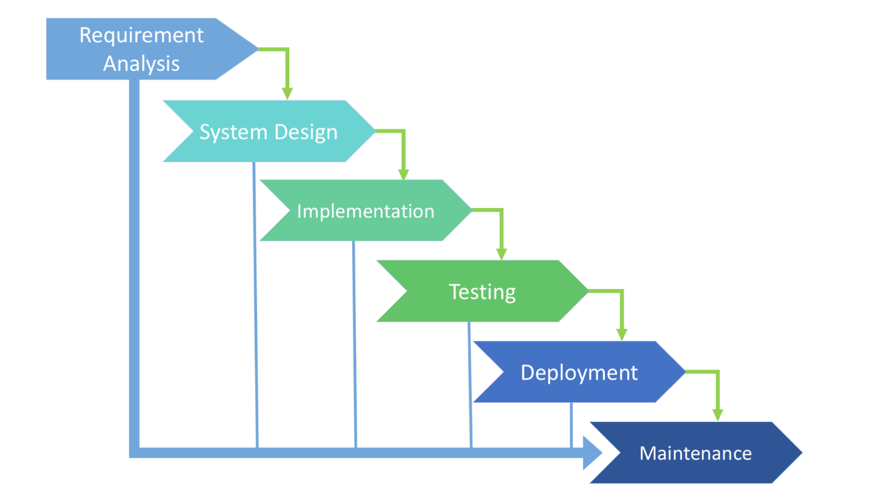
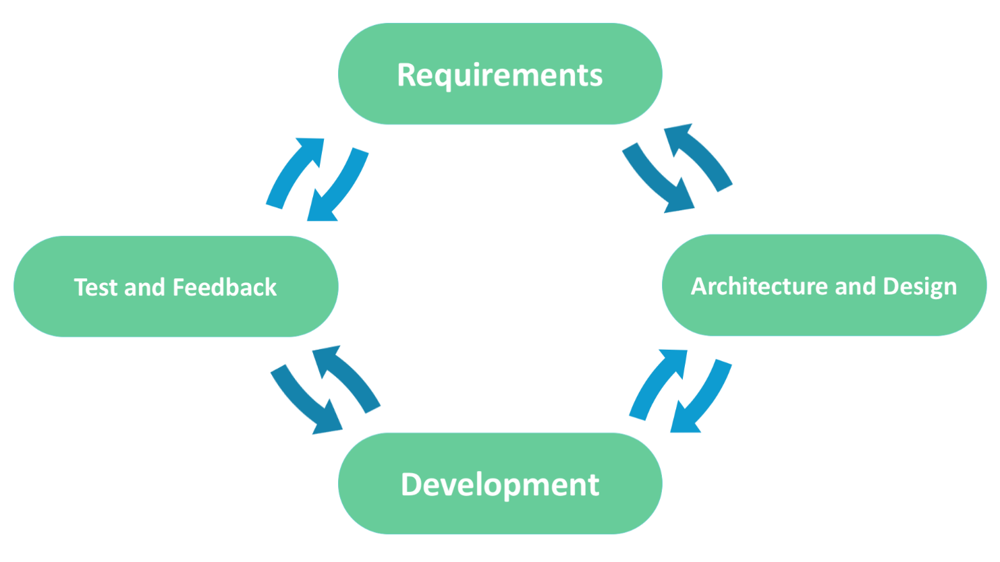

# Basics of SDLC models

## Waterfall Concept


**Waterfall** – is a cascade SDLC model, in which development process looks like the flow, _moving step by step through the phases_ of analysis, projecting, realization, testing, implementation, and support. This SDLC model includes _gradual execution of every stage completely_. This process is _strictly documented and predefined_ with features expected to every phase of this software development life cycle model.


The Waterfall model is the earliest SDLC approach that was used for software development.

It illustrates the software development process in a linear sequential flow. This means that any phase in the development process begins only if the previous phase is complete. In this waterfall model, the phases do not overlap.

### Phases

1. **Requirement Gathering and analysis** − All possible requirements of the system to be developed are captured in this phase and documented in a requirement specification document.
2. **System Design** − The requirement specifications from first phase are studied in this phase and the system design is prepared. This system design helps in specifying hardware and system requirements and helps in defining the overall system architecture.
3. **Implementation** − With inputs from the system design, the system is first developed in small programs called units, which are integrated in the next phase. Each unit is developed and tested for its functionality, which is referred to as Unit Testing.
4. **Integration and Testing** − All the units developed in the implementation phase are integrated into a system after testing of each unit. Post integration the entire system is tested for any faults and failures.
5. **Deployment of system** − Once the functional and non-functional testing is done; the product is deployed in the customer environment or released into the market.
6. **Maintenance** − There are some issues which come up in the client environment. To fix those issues, patches are released. Also to enhance the product some better versions are released. Maintenance is done to deliver these changes in the customer environment.

### **Advantages**

* Simple and easy to understand and use
* Phases are processed and completed one at a time
* Clearly defined stages
* Process and results are well documented

### **Disadvantages**

* High risks and uncertainty
* Inappropriate for the long-term projects
* Integration is done at the very end, which does not give the option of identifying the problem in advance
* Not suitable for the projects where requirements are at a moderate to high risk of changing.
* Cannot accommodate changing requirements

### When to use

* The requirements are precisely documented and not ambiguous \(no unknown requirements\)
* Product definition is stable
* The project is short

### Modifications

* Peter DeGrace's "sashimi model" \(waterfall with overlapping phases\)
* waterfall with subprojects
* waterfall with risk reduction
* "incremental waterfall model"
* Royce's final model

## Agile software development concept


**Agile** is an approach to software development, which advocates _adaptive planning_, evolutionary development, early delivery, and continual improvement, and it encourages rapid and _flexible response_ to change.


In the agile methodology after every development iteration, the customer is able to see the result and understand if he is satisfied with it or he is not.

### Agile manifesto

* **Individuals and Interactions** over processes and tools
* **Working Software** over comprehensive documentation
* **Customer Collaboration** over contract negotiation
* **Responding to Change** over following a plan

### Agile principles

1. Customer satisfaction by early and continuous delivery of valuable software.
2. Welcome changing requirements, even in late development.
3. Deliver working software frequently \(weeks rather than months\).
4. Close, daily cooperation between business people and developers.
5. Projects are built around motivated individuals, who should be trusted.
6. Face-to-face conversation is the best form of communication \(co-location\).
7. Working software is the primary measure of progress.
8. Sustainable development, able to maintain a constant pace.
9. Continuous attention to technical excellence and good design.
10. Simplicity—the art of maximizing the amount of work not done—is essential.
11. Best architectures, requirements, and designs emerge from self-organizing teams.
12. Regularly, the team reflects on how to become more effective, and adjusts accordingly.

### Agile development frameworks

* Extreme programming \(pair programming\)
* Feature-driven development
* Test-driven development
* Rapid application development \(extensive prototyping\)
* Scrum
* Kanban
* Scrumban

### Advantages

* Project is divided by short and transparent iterations
* Risks are minimized thanks to the flexible change process
* Fast release of the first product version

### Disadvantages

* Difficulties with measuring the final cost because of permanent changes
* New requirements may conflict with the existing architecture
* With all the corrections and changes there is possibility that the project will exceed expected time

### When to use

* The users’ needs change dynamically
* Expected many changes, no full clear requirements
* Need to start project fast

