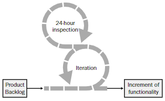
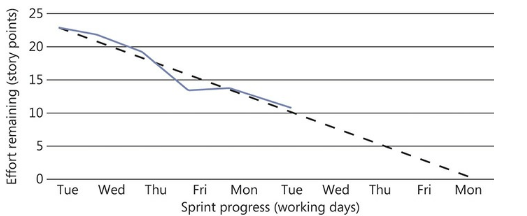

# Scrum


**Scrum** is a lightweight, _iterative and incremental_ agile framework for managing product development. It defines "a flexible, holistic product development strategy where a development team works as a unit to reach a common goal", challenges assumptions of the "traditional, sequential approach" to product development, and enables teams to self-organize by encouraging _physical co-location_ or close online collaboration of all team members, as well as _daily face-to-face communication_ among all team members and disciplines involved.


The skeleton operates this way: At the start of an iteration, the team reviews what it must do. It then selects what it believes it can turn into an increment of potentially shipable functionality by the end of the iteration. The team is then left alone to make its best effort for the rest of the iteration. At the end of the iteration, the team presents the increment of functionality it built so that the stakeholders can inspect the functionality and timely adaptations to the project can be made.

The heart of Scrum lies in the iteration. The team takes a look at the requirements, considers the available technology, and evaluates its own skills and capabilities. It then collectively determines how to build the functionality, modifying its approach daily as it encounters new complexities, difficulties, and surprises. The team figures out what needs to be done and selects the best way to do it.

### Limitations

* Teams whose members are geographically dispersed or part-time
* Teams whose members have very specialized skills
* Products with many external dependencies
* Products that are mature or legacy or with regulated quality control

### Roles and responsibilities

* Product owner
* Development team
* Scrum master

**Product owner \(PO\)** is responsible for delivering good business results. He is accountable for the product backlog and for maximizing the value that the team delivers. This role should not be combined with that of the scrum master.

* Creates the project’s initial overall requirements \(product backlog\) and release plans
* Negotiates priorities, scope, funding, and schedule
* Ensures that the product backlog is visible, transparent and clear
* Shares RAID \(Risks, Assumptions, Issues and Dependencies\) with stakeholders

**Development team** is responsible for delivering potentially releasable product increments every sprint. The sprint goal is a short description of what the team is supposed to deliver at the end of the sprint, and is important for both the Team and the stakeholders. It usually consists of 3-9 members, who carry out all tasks required to build the product increments \(analysis, design, development, testing, technical writing, etc.\)

* Self-organizing \(no one can tell the team how to convert a product backlog into a working product; the team decides itself how to overcome difficulties\)
* Self-managing \(scrum teams have no managers\)
* Cross-functional \(team is capable of doing all needed tasks\)

**Scrum master \(SM\)** is accountable for removing impediments to the ability of the team to deliver the product goals and deliverables. The scrum master is not a traditional team lead or project manager, but acts as a buffer between the team and any distracting influences.

* Teaches Scrum to everyone involved in the project, ensuring that everyone follows Scrum rules and practices
* Helps the scrum team to avoid or remove impediments to its progress
* Promotes self-organization within the team
* Helps the product owner to maintain the product backlog and ensures that it's well understood

### Artifacts

* **Scrum board.** Central to the daily workings of a Scrum project is the Scrum board. There should be a generous amount of wall space reserved for the Scrum board.
* **Cards.** The primary items on the Scrum board are the cards. The cards represent different elements of progress for a software product—from a physical release of the software down to the smallest distinct task.
* **Epics/Features.** Epic is a big requirement, which can't be implemented in one sprint. Epics should be splited into smaller parts - "stories".
* **Stories.** Stories, also called “user stories,” are short requirements or requests written from the perspective of an end user.
* **Tasks.** There is a unit of work smaller than a user story—the task. Stories can be broken down into more manageable tasks, which can then be split between the developers assigned to the story.
* **Backlogs**. The _product backlog_ is a model of work to be done and contains an ordered list of product requirements that a scrum team maintains for a product. Common formats include user stories and use cases. The _sprint backlog_ is the list of work the development team must address during the next sprint.
* **Sprint.** The sprint is a time-boxed effort; that is, it is restricted to a specific duration. The duration is fixed in advance for each sprint and is normally between one week and one month, with two weeks being the most common.
* **Increment.** The potentially releasable increment is the sum of all the product backlog items completed during a sprint, integrated with the work of all previous sprints.
* **Poker.** Scrum poker is a consensus-based, gamified technique for estimating, mostly used to estimate effort or relative size of development goals in software development.

### Estimation

* **Story Points.** A story point is a measure of relative effort required to implement the behavior that the user story represents. This is the inclusive effort required to fulfill the entire software life cycle. Story points are absolutely meaningless outside of the team that assigned them. A one-point story for one team might be a three-point story for another team.
* **Velocity.** Over multiple sprints, it is possible to calculate a running average of the achieved story points. 

  It can be used in two ways:

  * to form a ceiling for how many points a team should commit to for the next sprint;
  * to analyze problems with delivery \(underestimates, illness/vacation of key stuff\)

* **Sprint Burndown Chart.** The total number of story points is charted along the y-axis, and the number of working days is plotted along the x-axis. A straight diagonal line \(also known as the line of best fit\) is then drawn to show the ideal progression of the sprint.

* **Feature Burnup Chart.** Just as the sprint burndown chart tracks progress at story level throughout a sprint, the feature burnup chart shows the progress of completed features as they are implemented.

### Ceremonies

* **Release planning**. This involves the customer and the product owner deciding on a release date and prioritizing and sizing the features that are to be included.

  Sizing is usually done in T-shirts sizes:

  * Extra-Large \(XL\),
  * Large \(L\),
  * Medium \(M\),
  * Small \(S\),
  * Extra-small \(XS\)

  All features can be given one of three priorities:

  * Required \(R\)
  * Preferred \(P\)
  * Desired \(D\)

* **Sprint grooming.** The expected outcome of sprint planning is to estimate user stories.

  There are variations of the story estimation process:

  * planning poker, which is one of the more common ways to generate discussion,
  * and affinity estimation, a quicker way to estimate the relative size of stories

* **Daily Scrum.** The daily Scrum should not last longer than 15 minutes. To focus the meeting, everyone should answer these three questions:
  * What did you do yesterday?
  * What will you do today?
  * What impediments do you face?
* **Sprint demo.** It is a showcase of all of the completed stories—those that have met the definition of done during the sprint—in action in a real environment. The entire development team should be present, and you could also invite other stakeholders to the meeting.
* **Sprint retrospective.** Sprint overview to take stock of the iteration and gauge opinions about its overall success.

  The following questions should be asked of the team during the retrospective:

  * What went well?
  * What went badly?
  * What do we need to start doing?
  * What do we need to stop doing?
  * What do we need to continue doing?
  * Did we experience any surprises during the sprint?

