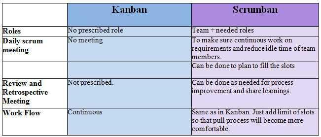
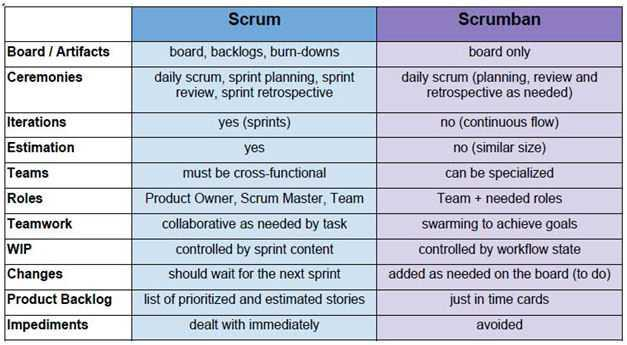

# Scrumban


**Scrumban** is an Agile management methodology describing hybrids of _Scrum_ and _Kanban_ and was originally designed as a way to transition from Scrum to Kanban. Today, Scrumban is a management framework that emerges when teams employ Scrum as their chosen way of working and use the Kanban method as a lens through which to view, understand and continuously improve how they work.


### **Kanban vs. Scrumban**

### **Scrum vs. Scrumban**

### **When to consider Scrumban**

* Maintenance projects
* Hardening/packaging phases
* Projects with frequent and unexpected user stories or programming errors
* Sprint teams focused on new product development
* If Scrum is challenged by workflow issues, resources and processes
* To manage improvement communities during/after Scrum roll-out

### **Scrumban Backlog**

* Avoid creating/analyzing too many stories \(requirements/defects\) – reduce waste
* Assure the necessary level of analysis before starting development
* The backlog should be event-driven with an order point
* Prioritization-on-demand – the ideal work planning process should always provide the team with best thing to work on next, no more and no less

