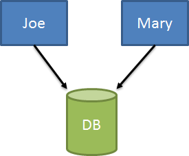
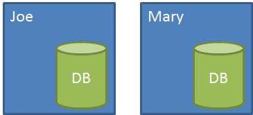
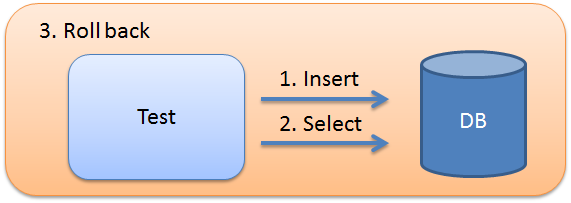

# Isolating database data in integration tests

One of the keys to having maintainable tests are to make sure that tests are isolated and reproducible. For unit tests, this is easy as long as we stay away from global variables, static classes and in general global state.

This becomes a bit of a challenge with integration tests that interact with a database, where state is by definition, global and shared. In order to have maintainable suite of integration tests, we need to make sure that our tests always have a consistent starting point.

Easier said than done, but luckily there are quite a few options for us here.

### Test database per developer

One mistake I see a lot of teams make is not properly isolating databases for each developer. I’ll often see a single shared dev database instance per team:



This makes testing and development frustrating for both involved, as not only do I have shared state on my own machine, but other people could be changing data out from under me. Not a good spot to be in! We can go another step further and have a local dev database per developer:



Our Dev database goes through schema migrations, but is never “wiped clean”. Its data remains around so that during development we don’t have to start with a blank database. Additionally, if development requires a lot of data in our dev database, we can still keep that around for normal development.

For testing, where we want deterministic setup conditions, the test database is only used for automated testing and is kept in a known state before each test. We only need to set up our migrations strategy to keep both local databases up to date locally \(but this shouldn’t be a problem with today’s migrations tools\).

Now that we have an appropriate local setup, let’s look at some options for keeping our test database in a reliably consistent state.

### Roll back transactions

One of the easiest ways to roll back changes made during a test is to…roll back changes made during a test. We open a transaction at the beginning of a test, do some work, and at the end of the test, we roll back that transaction.

Because databases \(depending on our isolation level\) include changes we’ve made inside a transaction with subsequent reads, our tests can still query for updates made. And then at the end of the test, our changes go away.



In our test, we can use setup/teardown or before/after test extensions to open an ambient transaction and roll it back afterwards. Our underlying data connections/ORM needs to be aware of ambient transactions for this to work properly, however. xUnit.net includes a simple extension to do so, with the AutoRollback attribute on our tests.

```csharp
private ITransaction _tx;

[SetUp]
public void SetUp()
{
    _tx = connection.BeginTransaction();
}

[TearDown]
public void TearDown()
{
    _tx.RollBack();
}
```

One side effect from this is that because our transaction is automatically rolled back, if we need to debug our test data _after_ the test is run, we can’t since the data is gone.

Additionally, if we need to have multiple transactions for whatever reason, this approach won’t work. Occasionally I work with systems that have a single activity with multiple transactions internally, all of which might be idempotent or can be run multiple times without affecting the one test, but aren’t rolled back.

If a simple rollback won’t suffice, we need to look at simply clearing out the database before each test.

### In-memory databases

If you can, using in-memory databases is another great option at wiping your database before each test. Instead of having a global database on our dev box for each tests, we can create an in-memory version of the database with each test.

Our ability to do this depends highly on a few factors:

* What kind of production DB we’re using
* What features of that production DB we’re using
* If there exists an in-memory version of the DB you’re using

No matter which way you go, keep in mind that the best tests, the most reliable tests, have a consistent, known starting point. The best way to achieve this is to have a local test database that can somehow reset itself, before or after tests, to a known state.

