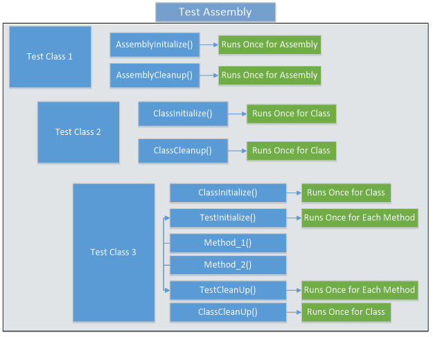

# Initialization and Cleanup \(Assembly, Class, Test\)

### Overview

There are six attributes you can use to perform initialization and cleanup. Which ones you use, depends on when you need to initialize something and/or clean something up. You can initialize/cleanup once for all classes within a unit test assembly. You can initialize/cleanup once for all test methods within a test class. You can initialize/cleanup before and after each test method runs within a class.

* AssemblyInitialize
* AssemblyCleanup
* ClassInitialize
* ClassCleanup
* TestInitialize
* TestCleanup

Add one or more of these attributes to a single method within your classes. You can see an example of how these attributes might be applied to a set of classes in your assembly displayed in Figure 1.



### Assembly Initialization and Clean Up

If you have several classes within a specific assembly and you need to create a database with some test records in some tables prior to running all, or the majority, of tests within these classes, create that database within a method decorated with the `[AssemblyInitialize]` attribute.

Only one method within your entire assembly may be decorated with the \[AssemblyInitialize\] attribute. This method must be static and the test framework will pass in an instance of the TestContext object.

```csharp
[AssemblyInitialize()]
public static void AssemblyInitialize(TestContext tc) 
{
    // TODO: Initialize for all tests within an assembly 
    tc.WriteLine(“In AssemblyInitialize”);
}
```

### Class Initialization and Clean Up

Just as you create classes in your application to encapsulate a specific set of functionality, organize your unit test classes the same way. Only one method within your test class may be decorated with the \[ClassInitialize\] attribute.

```csharp
[ClassCleanup()]
public static void ClassCleanup() 
{ // TODO: Clean up after all tests within this class
}
```

### Test Initialization and Clean Up

The method decorated with the \[ClassInitialize\] attribute only runs once the first time a class is created. A method decorated with the \[TestInitialize\] attribute will run before each test method within that class. If you have four methods in a test class, the TestInitialize method will run four times. As an example, if you need a specific file name to exist before all, or the majority, of tests within a class are run, create a method like the one shown below.

```csharp
[TestInitialize()]
public void TestInitialize() 
{
  // Create the Test.txt file.
  File.AppendAllText("Test.txt", "Some Text");
}
```

