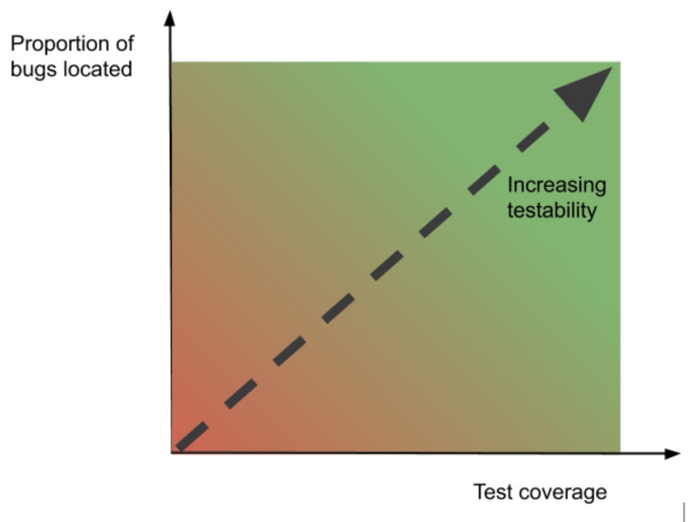

# Software testing basic concepts

Software testing can be stated as the process of verifying and validating that a software or application is bug free, meets the technical requirements as guided by it’s design and development and meets the user requirements effectively and efficiently with handling all the exceptional and boundary cases.

The process of software testing aims not only at finding faults in the existing software but also at finding measures to improve the software in terms of efficiency, accuracy and usability. It mainly aims at measuring specification, functionality and performance of a software program or application.

**Software testing can be divided into two steps:**  
1. **Verification:** it refers to the set of tasks that ensure that software correctly implements a specific function.

2. **Validation:** it refers to a different set of tasks that ensure that the software that has been built is traceable to customer requirements.

**Verification:** “Are we building the product right?”  
**Validation:** “Are we building the right product?”

**What are different techniques of Software Testing?**

Software techniques can be majorly classified into two categories:

1. **Black Box Testing:** The technique of testing in which the tester doesn’t have access to the source code of the software and is conducted at the software interface without concerning with the internal logical structure of the software is known as black box testing.

2. **White-Box Testing:** The technique of testing in which the tester is aware of the internal workings of the product, have access to it’s source code and is conducted by making sure that all internal operations are performed according to the specifications is known as white box testing.

| BLACK BOX TESTING | WHITE BOX TESTING |
| :--- | :--- |
| Internal workings of an application are not required. | Knowledge of the internal workings is must. |
| Also known as closed box/data driven testing. | Also known as clear box/structural testing. |
| End users, testers and developers. | Normally done by testers and developers. |
| This can only be done by trial and error method. | Data domains and internal boundaries can be better tested. |

### Software testability \(how to improve it?\)

You might naively think all software is equally easy or hard to test. But you only have to look at how developers write [unit tests](https://www.toptal.com/qa/how-to-write-testable-code-and-why-it-matters) to realize this isn’t so. Without suitable hooks for testing, many functions can only be tested implicitly by calling them from somewhere else and inspecting the results. Such functions are not very testable. But a well-designed function will include its own unit tests. These allow you to verify for certain that the function is working correctly. In effect, this is making the function testable.

Further up the testing hierarchy, things become less clear-cut. Here, testability is about two things. Firstly, can you actually test the software, and secondly, how likely is it that your tests will reveal any bugs. The following diagram shows how this relates to the testability of your application.

### **Improving testability**

Below the system level in the testing hierarchy, improving software testability is largely about improving your code. This will involve things like adding explicit unit tests, utilizing tools that [measure test coverage](https://afourtech.com/how-to-measure-test-coverage/), [code reviews](https://en.wikipedia.org/wiki/Code_review), and the use of consistent code style. At the integration test stage, it involves understanding how each subsystem should function and may involve creating code to test for this. Where things get interesting is at the system testing stage.

