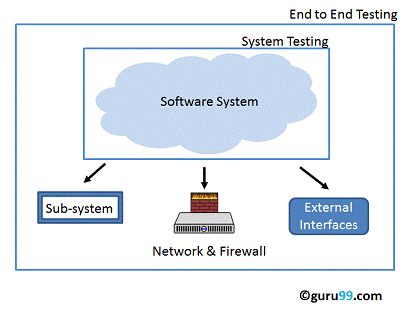

# Testing Levels

### Unit testing

A Unit is a smallest testable portion of system or application which can be compiled, liked, loaded, and executed. This kind of testing helps to test each module separately.

The aim is to test each part of the software by separating it. It checks that component are fulfilling functionalities or not. This kind of testing is performed by developers.

### Integration testing

Integration means combining. For Example, In this testing phase, different software modules are combined and tested as a group to make sure that integrated system is ready for system testing.

Integrating testing checks the data flow from one module to other modules. This kind of testing is performed by testers.

### End to End Testing

End-to-End Testing is defined as a type Software Testing that not only validates the software system under test but also checks its integration with external interfaces. Hence, the name "**End-to-End**". The purpose of End-to-End Testing is to exercise a complete production-like scenario.

Along with the software system, it also validates batch/data processing from other upstream/downstream systems.

End to End Testing is usually executed after functional and [System Testing](https://www.guru99.com/system-testing.html).

It uses actual production like data and test environment to simulate real-time settings. End-to-End testing is also called Chain Testing

#### Why End to End Testing?

Modern software systems are complex and are interconnected with multiple sub-systems

A sub-system may be different from the current system or may be owned by another organization.  **If anyone of the sub-systems fails, the whole software system could collapse**. This is a major risk and can be avoided by End-to-End testing. End-to-End testing verifies the complete system flow. It increases Test coverage of various sub-systems. It helps detect issues with sub-systems and increases confidence in the overall software product.

### Manual testing


Manual Testing is a type of Software Testing where Testers manually execute test cases without using any automation tools. Manual Testing is the most primitive of all testing types and helps find bugs in the software system.

Any new application must be manually tested before its testing can be automated. Manual Testing requires more effort but is necessary to check automation feasibility.

Manual Testing does not require knowledge of any testing tool.

One of the Software Testing Fundamental is "**100% Automation is not possible**".

This makes Manual Testing imperative.

